# umsakazo
NanoVNA RF Learning board - RF demo kit SMA training (All MIT License, design files will be released by the end of 2027)

## You can now buy it at [https://www.rootkit.es ](https://www.elecrow.com/umsakazo-rf-training-board-for-nanovna.html)

If you register on Elecrow using this link before buying the product, you’ll help me support and maintain this project even more:
- [https://www.elecrow.com/referral-program/OTI1MDhqMnQ/](https://www.elecrow.com/referral-program/OTI1MDhqMnQ/)
- [https://www.elecrow.com/umsakazo-rf-training-board-for-nanovna.html](https://www.elecrow.com/umsakazo-rf-training-board-for-nanovna.html)

-------


-------

Here’s an introductory **VIDEO** DEMO on how to use the UMSAKAZO board:

[https://youtu.be/kYVsM9EE5ec ](https://youtu.be/kYVsM9EE5ec)

-------

# Frequency range for each demo


-------

# Story behind the project


The famous green "RF Demo Kit for NANOVNA" board with UFL connectors was a pain to use with students in my hardware hacking bootcamps. On top of that, you can't make many connections and disconnections without breaking something. That's why I decided to design this demonstration board with SMA connectors. 

It's more robust, easier to use and solder, and allows experimenting with different components and configurations to learn about RF and NanoVNA usage.

I also incorporated the concept from the famous "NanoVNA Testboard Kit," but with a larger prototyping area to fit more components.

I built everything pretty much from scratch in my own way. I hope you like the idea.

Additionally, the board comes fully assembled with high-quality 0805 SMD components (C0G, thin film... without exceeding the target price).

Being larger with more components, including more expensive components and through-hole parts, and more soldering required, the board is naturally more expensive.

If you look for a cheap SMA alternative, check this project by IMSAI Guy, but you need transplant components from the original UFL board: https://www.youtube.com/watch?v=2W0pjMk56rA

Btw, the IMSAI Guy's board is better from the point of view of RF performance, but umsakazo is designed for learning and experimentation, not for precision measurements, so I prioritized ease of use and component accessibility over high-frequency performance.

## Why umsakazo name? 

umsakazo means radio in Zulu (South Africa)

# Getting Started with NanoVNA and umsakazo

Learn how to use NanoVNA and some electronics from scratch with umsakazo, the NanoVNA RF Learning board (RF demo kit SMA training). This tutorial will guide you through the basics of using a NanoVNA, understanding S-parameters, and performing simple measurements with the umsakazo board.

This documentation is written for the **NanoVNA-F V2 50KHz-3GHz** (AURSINC / Seesii)

# Basics

Passive components don't behave the same way at every frequency. An ideal resistor is the calm one: its impedance stays flat no matter how fast the signal changes. Capacitors and inductors are mirror images of each other push the frequency up and a capacitor's impedance drops (it lets fast signals through), while an inductor's impedance climbs (it pushes back against fast signals). That's the clean textbook picture, and it's the first thing to keep in your head.

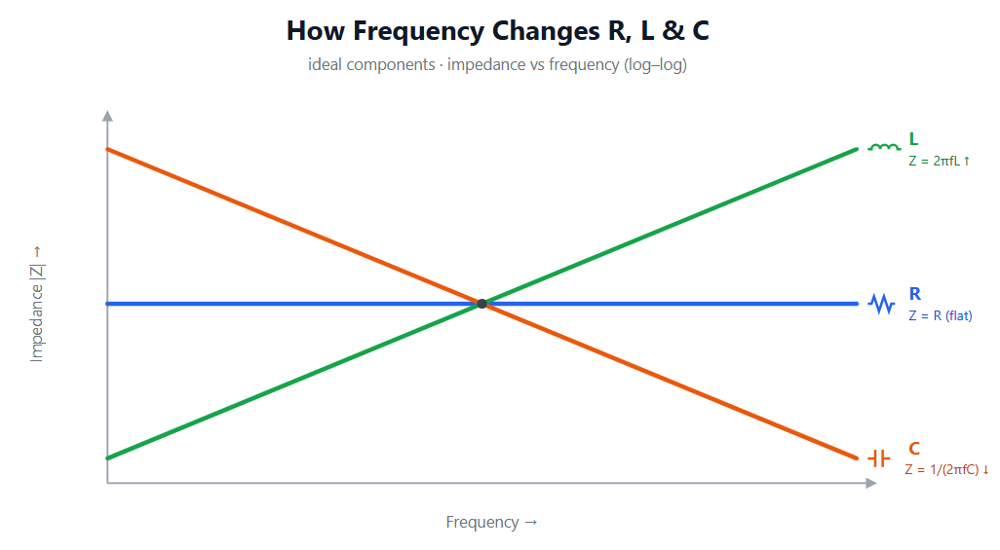

But no real part is perfect. Every lead, pad and winding hides a tiny bit of extra inductance and capacitance its parasitics. At a certain point, the self-resonant frequency (SRF), these hidden elements take over and the component flips character: above its SRF a capacitor starts behaving like an inductor, and an inductor starts behaving like a capacitor. This is exactly why through-hole parts struggle at high frequencies their long leads and bulkier construction add more parasitics and drag the SRF down, so they flip far sooner than tiny surface-mount parts with their short leads. When you need clean high-frequency behavior, short leads and small packages win.

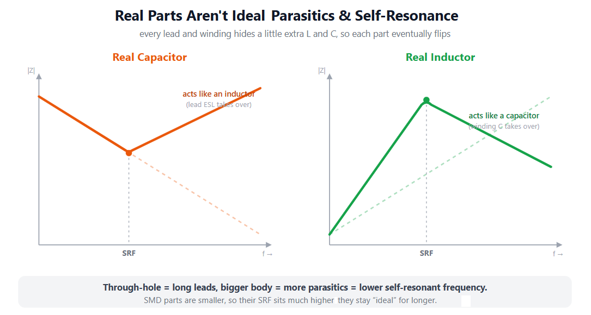

A resistor is the simplest component, but it isn't immune to parasitics either. It stays a clean, flat "R" only up to a corner frequency after that, its value and build take over. Low-value and wirewound resistors have enough lead and winding inductance that their impedance starts to rise: they begin acting like inductors. High-value, thin-film resistors are the opposite the tiny capacitance across their body bypasses them at high frequency, so their impedance falls and they start acting like capacitors. The lesson is the same as before: long leads and bulky construction push that corner down, while small surface-mount parts keep the flat region the widest.

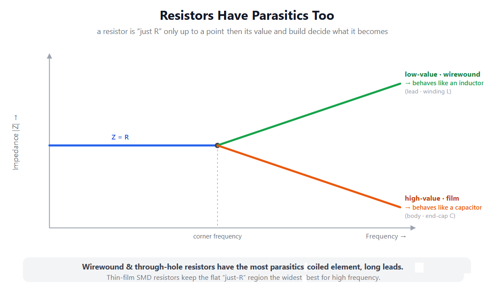

-----

A couple of details make the real picture even richer. At a capacitor's SRF the impedance doesn't drop to zero; it bottoms out at the part's ESR (its equivalent series resistance), so a lower ESR means a deeper, sharper dip. The reason there's a dip at all is the ESR's inductive twin: every real capacitor also carries a tiny equivalent series inductance, or ESL. Below the SRF the capacitance dominates and the impedance falls; right at the SRF the capacitive and inductive reactances cancel and all that's left holding up the bottom is the ESR; above the SRF the ESL takes over and the "capacitor" climbs back up, behaving like an inductor. The SRF is simply the frequency where C and ESL ring together, f = 1/(2π√(ESL·C)). Inductors play the same game in reverse. A real inductor is more than its L: the turns of wire sitting next to each other store charge, giving the part a parasitic winding capacitance that sits in parallel with the coil. The two resonate at the inductor's own SRF, fixed by the very same 1/(2π√(LC)) relation, only now L is the coil's inductance and C is that winding capacitance. The difference is that this is a parallel resonance, so the impedance peaks instead of dipping: below the SRF the part is inductive and its impedance rises; right at the SRF the L and the winding capacitance ring in parallel and the impedance shoots up to a tall peak, limited only by the inductor's losses (the higher its Q, the taller and sharper that peak); above the SRF the capacitance wins and the "inductor" starts behaving like a capacitor, with impedance falling again. So a capacitor turns inductive past its SRF and an inductor turns capacitive past its own, each one impersonating its opposite once you push it high enough. Resistors can go further than a simple bend, too: if one has both noticeable lead inductance and body capacitance, those two parasitics form their own tiny resonant tank, so instead of just curving up or down it can show a genuine resonance, an actual peak in its impedance. And here's the wild part: a real circuit is full of parasitic Ls and Cs scattered everywhere, and every pairing rings at its own frequency. So the impedance of a real board isn't one clean curve with a single SRF; it zig-zags through many resonances at many different frequencies, with sharp dips where things resonate in series and tall peaks (anti-resonances) where they resonate in parallel. Taming that messy impedance profile is exactly the job when you design a power-distribution network (PDN).

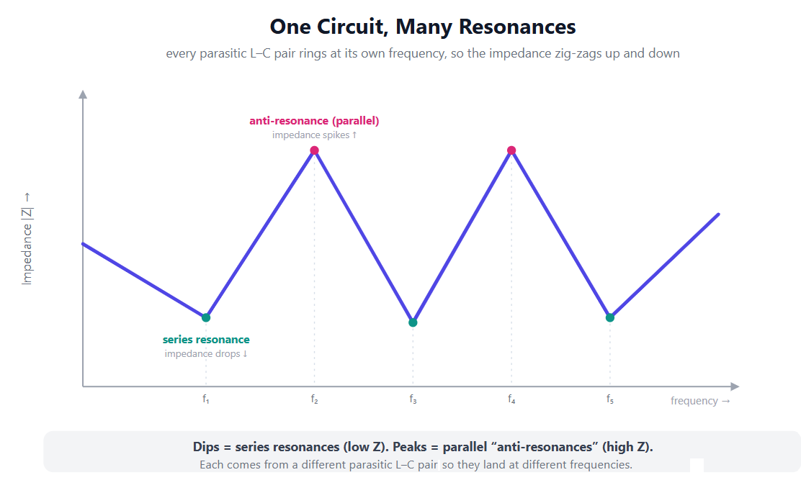

---

So far we've only talked about how much a component impedes a signal its impedance magnitude. But impedance has a second half: phase, the timing shift it puts between voltage and current. A resistor keeps them in step (0°): voltage and current peak together. An inductor makes voltage lead current by 90°; a capacitor makes voltage lag by 90° opposite corners again, just like with magnitude. The old mnemonic is ELI the ICE man: in an inductor (L) voltage (E) leads current (I); in a capacitor (C) current (I) leads voltage (E). That 90° is more than trivia because voltage and current sit a quarter-cycle apart, an ideal inductor or capacitor stores energy and hands it straight back instead of burning it, so only the resistor's 0° actually dissipates power. Phase is also the cleanest way to catch a part flipping character: right at its self-resonant frequency the phase swings through 0° and changes sign, so a "capacitor" that has gone inductive shows it in its timing, not just its impedance.

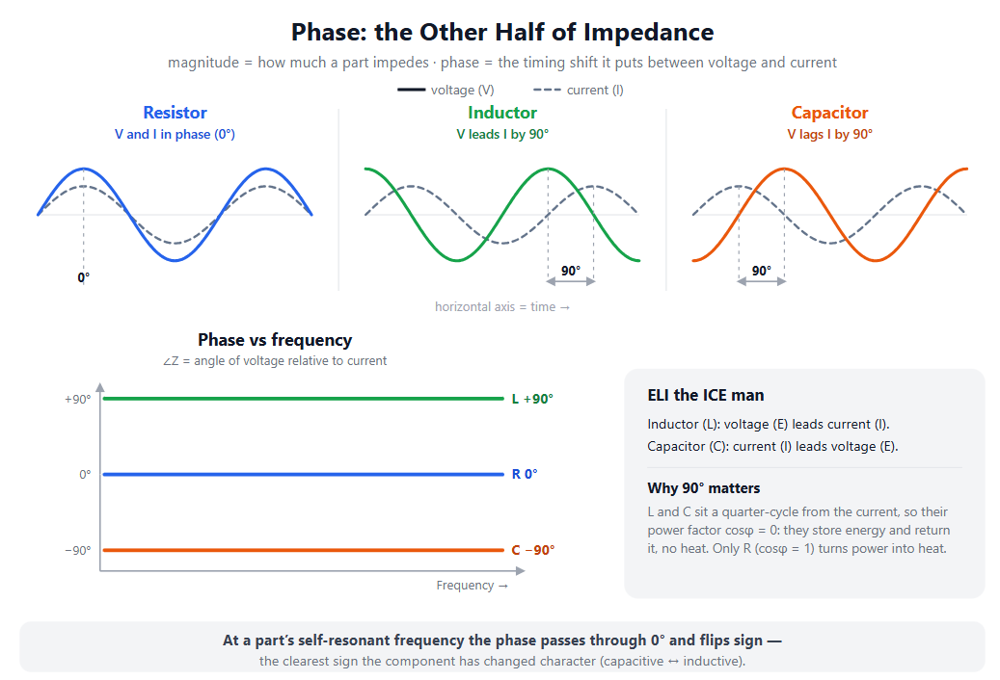

So how do you actually capture any of this? There are two very different routes. The hands-on one is an oscilloscope. You drop a small known shunt resistor in series and watch the voltage across it, and by Ohm's law that voltage is the current, just scaled, so you see both waveforms and read the phase straight off the screen. If you'd rather not break the circuit, a clamp-on current probe does the same job: a transformer-type probe for AC, or a Hall-effect one that also reads DC, feeds the current waveform straight into the scope. Either way you stay in the time domain, watching voltage and current directly. A vector network analyzer (VNA), like a NanoVNA, works nothing like that, and it never measures current at all. It sweeps a wave across frequency into the part, measures how much bounces back (the incident and reflected waves), and reports their ratio as S11, a complex number with magnitude and phase. Knowing its own port impedance is 50 Ω, it then computes the impedance from that reflection: Z = Z₀·(1 + S11)/(1 − S11). The current is never seen, only inferred. What it captures directly is the phase of the reflection; from that it can also display the impedance phase, the same voltage-versus-current angle you'd read on the scope, but even that is calculated, never measured. That is also why a VNA must be calibrated (open, short, load) before any of it means anything: the calibration is what tells the instrument where "incident" ends and "reflected" begins at the tip of your cable.

S11 is only half of the story of what NanoVNA can do. S11 is a reflection measurement: signal goes into port 1, and you look at what bounces back out of port 1. S21 is a transmission measurement: signal still goes into port 1, but now you read what comes out of port 2, on the far side of whatever you connected between them. So S11 answers "how much of my signal got rejected at the door?", while S21 answers "how much of it made it through to the other end, and with what phase?". That makes S21 the natural way to characterize anything a signal passes through: filters, cables, amplifiers, attenuators. A low-pass filter, for instance, shows an S21 near 0 dB (everything passes) in its passband and a steep drop into deep negative dB as it starts blocking. Like S11, S21 is complex, so it carries both magnitude (how much made it through) and phase (how much the part delayed it). And just like before, it means nothing without calibration, only now the through path matters too, so a proper two-port cal adds a "thru" step to the open, short and load.

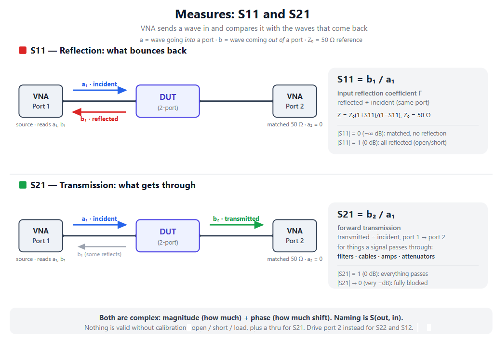

---

Everything above is an AC thing it only happens because the signal keeps changing. In DC, frequency is zero, so there's nothing to react to. A capacitor charges once and then blocks DC like an open circuit; an inductor settles into a plain wire, a short with only its winding resistance left. A resistor doesn't care R is R in DC and AC alike and the parasitics vanish too: a stray inductance becomes just wire, and a stray capacitance just an open gap. Frequency is what brings all these effects to life; switch it off and you're back to plain resistors, open capacitors, and shorted coils.

----

One last reality check before you trust a NanoVNA with everything. A NanoVNA always measures relative to 50 ohms, and it is happiest when whatever sits on the end of the cable is somewhere near 50 ohms. Push toward very high impedance (a tiny capacitor, a high-value resistor) or very low impedance (a big capacitor, a tiny inductor, almost a short) and the measurement crowds into the outer rim of the Smith chart, where nearly all the signal reflects and the readings turn twitchy: a tiny error in what the instrument actually measures becomes a huge error in the impedance it reports back. As a rough guide, treat about 5 to 500 ohms (roughly a decade either side of 50) as the trustworthy zone, and take anything well outside it with a pinch of salt. Calibration (short, open, load) only fixes the reference point right at the connector, so every adapter, clip lead and bit of breadboard beyond it adds stray inductance and capacitance that the NanoVNA cheerfully blames on your component, and that only gets worse the further you are from 50 ohms and the higher you go in frequency. You can still point it at a 75-ohm cable or an antenna, but its SWR and Smith chart are drawn for a 50-ohm world unless you renormalize in software (something like NanoVNA-Saver) or add a matching pad. And remember it is a budget tool: its dynamic range is modest, so it cannot see the very deep notches of a high-rejection filter, and its accuracy tails off at the very top of its frequency range. For pinning down an exact component value an LCR meter or impedance analyzer is the better instrument; for very high or very low impedances the shunt-and-scope trick from earlier often wins; and the NanoVNA truly shines where it was meant to: 50-ohm-ish things like antennas, feedlines, filters and matching networks.

# The NanoVNA: the perfect tool for making a fool of yourself in a very sophisticated way

Here is the trap, and it is worth saying out loud: the NanoVNA does not lie. After a good calibration it tells you the precise, honest truth about whatever is sitting at the end of that cable. The catch is that "whatever is sitting at the end of that cable" is almost never just the component you think you are measuring, and it is almost never in the situation it will actually live in. So you can get a gorgeous, authoritative looking Smith chart for something that has very little to do with your real circuit, and that misplaced confidence is exactly what lets you be wrong in a very sophisticated way.
Take a component soldered onto an SMA connector, or plugged into the Testboard. What you measure is not "the resistor" or "the capacitor": it is that part plus its legs, plus the pads, plus the connector, plus the little patch of ground around it. At a few MHz those extras are invisible and the reading is basically the part. Higher up they start to matter, and now you are measuring the part welded to this particular fixture. And it gets worse if that connector or adapter is a cheap, no-name part with no datasheet: an unknown, badly controlled impedance right in the signal path adds its own mismatch and parasitics on top of everything else, so now you are not even sure how much of the mess is your component and how much is the random SMA you grabbed from the drawer. "Fine," you say, "I will de-embed it and recover the bare component." Even then there is a deeper catch: that same bare part, dropped into a different final PCB with different trace lengths, a different ground plane and different neighbors, will show a different effective inductance or capacitance and a different self-resonant frequency. RF parts do not carry a single true value around in their pocket; they have a value in a context. Measuring a part on the Testboard to predict how it will behave somewhere else is a bit like weighing yourself on the Moon to learn your weight on Earth: the scale is honest, the number is just answering a different question. The Testboard is perfect for seeing the effect and building intuition. It is not a machine for extracting numbers you can paste into a different design. For an exact part value, an LCR meter or impedance analyzer is the right tool; to know how the part behaves in the product, you have to measure it in the product, or in a faithful copy of it.
Antennas are the same trap, only bigger and more spectacular. A lot of the small antennas you will meet are not designed to work on their own at all: the device they plug into is part of the antenna. A quarter-wave monopole is only half an antenna until it has a ground plane or counterpoise to act as its other half. The PCB antennas and chip antennas inside real products (inverted-F, meandered monopoles and friends) are tuned in the datasheet for a specific ground-plane size and a specific keep-out area, and they go straight out of tune the moment that ground is different. And the measurement itself joins in: feed an antenna from coax without a common-mode choke and the outside of the cable shield starts carrying current and radiating, so now the feedline is part of the antenna too, while your hand and the bench cheerfully detune the rest. Measure an antenna like this on its own and you get a precise S11 and a clean SWR curve for a system that will never exist in your product. The conclusion can even come out backwards: an antenna that looks "perfect" alone on the bench can be useless once it sits in the enclosure on the real board, and one that looks "broken" on its own can be exactly right as part of the finished device. Plenty of antennas are deliberately designed to be perfect only when plugged into the gadget, never by themselves. So the honest way to measure an antenna is in its real situation: the real ground plane or enclosure, a proper common-mode choke on the feed, and a setup that looks like the product instead of a bench experiment.
None of this makes the NanoVNA useless, quite the opposite. It just means the real skill is not reading the screen, it is making sure that the thing on the end of the cable is actually the thing you care about. Get that wrong and the NanoVNA will happily help you be confidently, beautifully, scientifically wrong. Get it right and it is one of the best learning and debugging tools you can put on a bench.

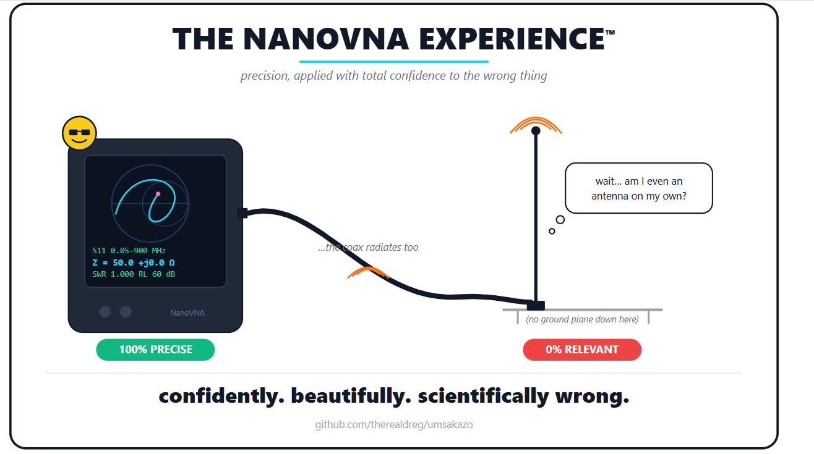

# Even the amount of solder matters

There is one more contributor that is easy to overlook: the solder
itself. How much solder you put on a joint, and not just whether the
joint is electrically sound, changes what the NanoVNA sees, and it does
so in two different ways.

First, solder is metal, so a big, blobby joint simply adds more conductor
sitting next to the pads, the pins and the nearby ground. That extra
metal presents extra surface to everything around it, and extra surface
facing a nearby conductor is, by definition, extra parasitic capacitance.
A fat blob therefore adds a little capacitance to whatever you are
measuring, nudging its effective value and pulling its self-resonant
frequency down. On a capacitor you are literally adding to its
capacitance; on anything else you are quietly contaminating the value.
Of the two solder effects, this capacitive one is the gentler: it shows
up lower in frequency, but it is small and depends heavily on how close
the blob sits to ground or to the other terminal.

Second, and this is the less obvious part, solder is a much worse
conductor than copper, the better part of an order of magnitude: roughly
seven to ten times worse depending on the alloy (lead-free tin-silver-copper
nearer the low end, eutectic tin-lead nearer the high end). At DC this is
irrelevant, because the current flows through the whole cross-section and
most of that path is copper anyway; a small blob of solder has a truly
tiny DC resistance. But at RF the current does not use the whole
conductor: the skin effect squeezes it into a thin surface layer, only a
few micrometres deep near the top of our range and some tens of
micrometres lower down. And here is the key fact, the very same one that
makes silver plating work in reverse: the RF current rides on the
outermost skin of the joint, and a surface layer only really takes over
the current once it is a few skin depths thick. In solder, one skin depth
is around 19 micrometres at 100 MHz and about 6 at 1 GHz, so a fat blob
(hundreds of micrometres) is many skin depths of the bad conductor: the
RF current flows almost entirely in the solder and never reaches the good
copper underneath. The result is more series resistance at RF, more loss
and a lower Q, which shows up as a shallower, more damped notch or a
lower, broader resonant peak. A thin, clean tinning, by contrast, is far
less than one skin depth at these frequencies, so the current still
mostly sees the copper below it. This effect grows with frequency, so it
stays hidden at a few MHz and becomes more and more visible as you climb. 

It is the same family of problem as the nickel in ENIG board finishes,
only nickel is ferromagnetic and so an even worse RF conductor (nickel only really wakes up in the microwave range and on low-loss
substrates; at the frequencies of this board, and on FR4 where the
dielectric loss dominates anyway, the surface finish is the least of your
worries. ENIG is perfectly fine here).

There is also a third, more mundane reason to be consistent: every
hand-soldered joint is slightly different, so if you want to compare two
components fairly, use a similar, small amount of solder on both.
Otherwise part of the difference you see on screen is just the difference
in your soldering, not in the parts.

A sense of proportion, though: on this kind of board the amount of solder
is a second- or third-order effect, well behind the lead inductance
(around 1 nH per millimetre) and the undefined impedance of the header
pins. It matters most when everything else is already clean and you are
pushing toward the high end of a demo. So the rule "use as little solder
as possible" is not about tidiness, it is electrical: less solder means
less added capacitance, less RF loss and more repeatable measurements,
even if it will never be the thing that dominates your error here.

The takeaway: lead is the component that drags conductivity down, so
lead-free solder comes out slightly ahead on paper. But the difference
between alloys is noise compared to the two things that actually matter
here: using as little solder as possible, and making a clean,
mechanically sound joint.

That second point deserves more than a passing mention, because a bad
joint can wreck a measurement far more than any choice of alloy. A cold
or poorly wetted joint, the kind that sits as a dull, grainy lump instead
of flowing into a smooth, slightly concave fillet, never forms a proper
metallurgical bond with the copper. Hidden underneath are micro-cracks
and patchy contact, which means extra series resistance and inductance
that are not even constant: they drift with temperature, with vibration,
and with every time you flex the board or re-plug a part. For an
instrument whose whole job is to measure small differences, that is the
worst possible failure, because the reading stops being repeatable. Part
of what you see moving on screen is no longer the component, it is your
joint shifting under your hands. This bites even harder on a fixture like
the Testboard, where parts are plugged, unplugged and prodded constantly,
so a marginal joint quietly fatigues and cracks over time.

A good joint is the opposite: the solder wets both the pad and the lead
and pulls itself into a thin, smooth, slightly concave shape, using the
least metal that does the job. Heat the pad and the lead rather than the
iron tip, let the solder flow in by capillary action, use flux for clean
wetting, and do not move anything while it freezes. One detail worth
knowing so you do not chase a non-problem: tin-lead joints look shiny
when they are good, but lead-free is naturally a little duller, so do not
read dullness on its own as a bad joint; judge it by the wetting and the
shape instead. A joint made this way is low-resistance, stable and
repeatable, and it will beat the fanciest alloy applied badly every
single time. So the real rule is not "pick the best solder", it is "use
as little as you can and make every joint a good one": get that right and
the alloy barely matters.

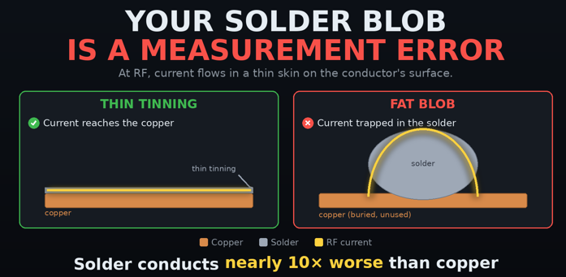

# Let's start 

Assume you have the latest firmware installed and everything configured by default, as it comes from the factory.

Reset using Tera Term or any serial terminal:

```
ch> clearconfig 1234
Config and all cal data cleared.
ch> saveconfig
Config saved.
ch> reset
Performing reset
```

Now disconnect NanoVNA from the computer and power off, then power it on again to start with a clean slate. Repeat power-off and power-on two times to ensure all settings are reset.

# Your first demo: SMITH S11 - RC Series


First, press on the right side of the screen to enter the NanoVNA main menu.


Select "Stimulus" to configure the frequency range.


Select "Start/Stop" to set the frequency range for your measurements (1 MHz - 250 MHz for the RC Series demo).


After clicking OK, press the right side of the screen to access the menu again, then select "Stop" to set the stop frequency range:


Press on the right side of the screen to enter the NanoVNA menu.


Select "Back" to return to the main menu.


Select "CAL" to enter the calibration menu.


Select "Reset CAL" to clear any previous calibration data (it is important to start with a clean slate for accurate measurements).


Select "Calibrate" to start the calibration process.


Connect PORT1 to the "Open" calibration standard on the umsakazo board, then select "Open" on the NanoVNA screen to perform the open calibration step.


Next, connect PORT1 to the "Short" calibration standard on the umsakazo board, then select "Short" on the NanoVNA screen to perform the short calibration step.


Next, connect PORT1 to the "Load" calibration standard on the umsakazo board, then select "Load" on the NanoVNA screen to perform the load calibration step.


Next, connect PORT1 (left) and PORT2 (right) to the "Thru" calibration standard on the umsakazo board, then select "Thru" on the NanoVNA screen to perform the thru calibration step.


Select "Done" to complete the calibration process.


Select SAVE 0 to save your calibration.


Select "S11 SMITH" from the top-left corner of the screen to display the S11 parameter on the Smith chart. The S11 green rectangle should be selected.


Connect the RC Series demo component on the umsakazo board to PORT1, and you should see the S11 response on the Smith chart.


In an RC series circuit, the impedance changes with frequency. At low frequencies, the capacitor acts as an open circuit (right). As frequency increases, the capacitor's reactance decreases, allowing current to flow more easily, and the impedance moves toward the 50-ohm center point. Since the 50-ohm resistor remains constant (aprox) while the capacitor's reactance decreases with frequency, the impedance traces a semicircle from the open-circuit point toward the ~50-ohm point.

Note: not all time is exactly 50 ohms, as the components and PCB design introduce variations, but you should see the general behavior of the RC series circuit on the Smith chart.

Now, you can use the cursor 1 to analyze the response. Press on the 1 cursor to select it, then use stick to move it around the Smith chart and observe how the S11 parameter changes with frequency. 


REMEMBER: Every time you change the frequency range, you must recalibrate your NanoVNA to obtain accurate results. Calibration compensates for losses and characteristics of your measurement system, ensuring that your results are as precise as possible within the limitations of the PCB design and components used.

# Your second demo: SWR S11 - 33 ohm


Recalibrate your NanoVNA for the new frequency range: 1 MHz - 100 MHz, and perform the same calibration steps as before: Reset CAL, (Open, Short, Load, Thru) to ensure accurate measurements for the 33 ohm demo.

Select DISPLAY from the main menu to enter the display settings.


Connect PORT1 to the 33 ohm demo component on the umsakazo board, and you should see the S11 response on the screen.


Select TRACE from the display menu to configure the trace settings.


Select TRACE3 to configure the settings for the third trace.


Select FORMAT to change the display format for the trace.


Select SWR to display the Standing Wave Ratio (SWR) for the S11 parameter.


Select S11 (REFL) to display the S11 parameter for the SWR trace.


Now you should see the SWR response for the 33 ohm demo on the screen. The 1.5:1 SWR line indicates the point where the impedance is 33 ohms, which is a mismatch from the 50-ohm reference impedance. Is 1.5:1 because 33 ohms is 1.5 times less than 50 ohms (50/33 ≈ 1.5). The SWR will be higher at frequencies where the impedance mismatch is greater, and it will approach 1:1 at frequencies where the impedance is closer to 50 ohms.


# Your third demo: S21 LOGMAG - Band Stop


Recalibrate your NanoVNA for the new frequency range: 1 MHz - 9 MHz, and perform the same calibration steps as before: Reset CAL, (Open, Short, Load, Thru) to ensure accurate measurements for the Band Stop demo.

Connect PORT1 to the input (left) and PORT2 to the output (right) of the Band Stop demo component on the umsakazo board, and you should see the S21 response on the screen.


Now you can view the S21 LOGMAG response for the Band Stop demo. The S21 parameter represents the transmission coefficient, and in a band stop filter, you should see a drop in the S21 magnitude at the frequencies where the filter is designed to attenuate signals. The LOGMAG format displays the magnitude of S21 in decibels (dB), making it easier to visualize the attenuation effect of the band stop filter.


Select S21 LOGMAG UP RIGHT SCREEN RECTANGLE.


Move cursor 1 to analyze the S21 response. You should see the frequency and magnitude values for the point where the cursor is located, allowing you to identify the center frequency of the band stop filter and the amount of attenuation it provides at that frequency.


Select DISPLAY from the main menu to enter the display settings again.


Select SCALE to adjust the scale settings for the S21 LOGMAG trace.


Select 2. 


Now you should see the S21 LOGMAG response for the Band Stop demo with a scale of 2 dB per division, allowing you to better visualize the attenuation effect of the band stop filter across the frequency range.


# Fun with the Testboard

Let’s have some fun with the Testboard. Here we can place through-hole components and see how they behave across the frequency range we care about.

The first step is to make a small DIY calibration kit so we can calibrate on the Testboard’s female header pins, something like this:

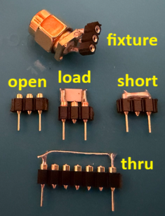

Shopping list for the DIY calibration kit (this is the one I use, based on the components I had at home and that best fit my purpose):
- PHP02512E49R9BST5 Vishay Dale (~5€) - Thin Film SMD 2.5watt 49.9ohm .1% 25 PPM 2512
    - datasheet: [stuff/doc/php.pdf](stuff/doc/php.pdf)
    - https://www.digikey.es/es/products/detail/vishay-dale-thin-film/PHP02512E49R9BST5/2508133?srsltid=AfmBOoqPkmv6Nf2_Xzknn7MlR4bIGy4XxmKVGG7BtdBB8IqsZc_BdU-b
    - https://www.mouser.es/ProductDetail/Vishay-Thin-Film/PHP02512E49R9BST5?qs=vSgF7M6Mj64d04hM8gmGaw%3D%3D&srsltid=AfmBOors1frlhNF_xuh7yemOyeOHtxyH1uPmSjlbQh4hqC6fkfiiNOuY
- 2.54 1row male gold Round Hole Pin 1x40P (~3€)
    - https://es.aliexpress.com/item/4001122376295.html
- 2.54 1row female gold Round Hole Pin 1x40P (~3€)
    - https://es.aliexpress.com/item/4001122376295.html
- SMA PCB 50 OHM connector male front (~3€)
    - https://es.aliexpress.com/item/1005004242324252.html?spm=a2g0o.order_list.order_list_main.229.2d6d194dWH1HOn&gatewayAdapt=glo2esp
- SMA PCB 50 OHM connector female front (~3€)
    - https://es.aliexpress.com/item/1005004242324252.html?spm=a2g0o.order_list.order_list_main.229.2d6d194dWH1HOn&gatewayAdapt=glo2esp

For the thru standard, I used pins+the leads from a through-hole resistor.

The most difficult part is soldering the resistor to the pins:

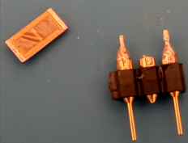

- Cut three pins.
- Trim the center pin at both ends (it is not used).
- Apply solder to the resistor ends and to the pins, then solder the resistor to the pins, making sure it is well centered and aligned. The 2512 SMD size is ideal and fits very well.

WARNING: Solder the resistor on the side that will be under the PCB, so the exposed pin ends (the side that plugs into a female header/connector) remain completely free and unobstructed.

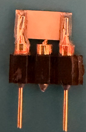

Before using a resistor for this kind of test, I recommend soldering it to a male SMA connector first, then checking its behavior with a properly calibrated NanoVNA:

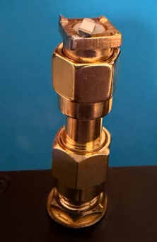

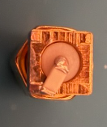


Here is an example of how the PHP02512E49R9BST5 resistor looks (5-100 MHz): 

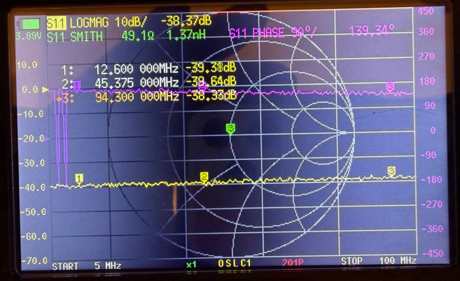

NOTE: you should calibrate right after the connector so you only measure up to the resistor itself... or use electrical delay (I haven't done either of those, haha).

--------

If you only have 1206 resistors, fitting one between two pins (with another pin in the middle) is tricky, but the process is the same. Be careful: if you bend the pins too much, they can break. Here is the improvised setup I made to add an extra load:

TNPW120649R9BEEA Vishay Dale (~0.50€) Thin Film SMD 49.9ohms .1% 25ppm 1206

- datasheet: [stuff/doc/tnpw_e3.pdf](stuff/doc/tnpw_e3.pdf)
- https://www.mouser.es/ProductDetail/Vishay/TNPW120649R9BEEA?qs=2reG4Y%252BdyC%252BDRhwn7mYgEw%3D%3D&srsltid=AfmBOoouHOrlxbLSlDdIEXQcODTZPmx6zTsWhHa9K0tSvQCHKqlFmruU
- https://www.digikey.com/en/products/detail/vishay-dale/TNPW120649R9BEEA/1607704

Here is the measured data of the TNPW120649R9BEEA resistor from 5 to 100 MHz, soldered to an SMA connector and measured with a NanoVNA that was fully calibrated beforehand (OPEN/SHORT/LOAD):

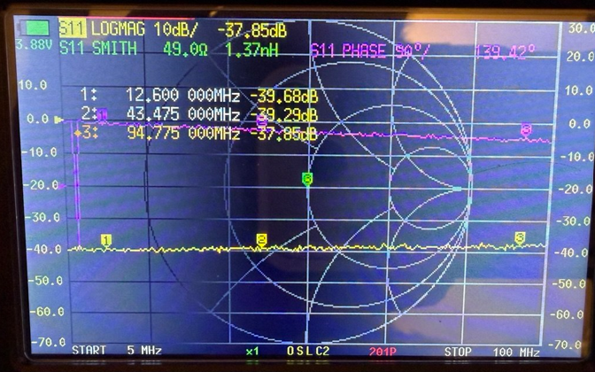

Now solder the TNPW120649R9BEEA resistor to the pins:

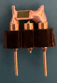

Way too much solder and a very messy crap job, haha.

Always use high-quality resistors with a datasheet, preferably thin-film and with 0.1% tolerance or better, so their behavior is as predictable as possible. If they are RF-rated, even better. Also, try to use as little solder as possible.

-----

Let's build the fixture. This lets you test parts with male pins: just solder three female header pins to a male SMA connector, and you will have a fixture ready to test components with male pins.

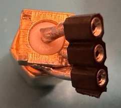

(Cut the center pin so it is not soldered to anything.)

Here is an example of how you could use this thing, with the 50 ohm DIY CAL LOAD connected to the fixture.

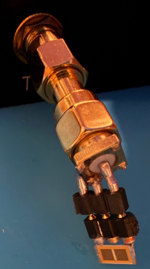

-------

We’ll make the open very simply and crappy: cut three male pins, cut the center pin above and below, and trim off the PCB-side section of all three pins. That’s it you now have a crap open.

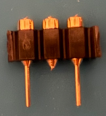

-----

For the short, do the same as for the open, but solder the two outer pins together; the center pin must not touch any solder.

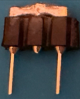

---

For the thru, we cut 7 male pins, remove all pins except the two ends, and solder a resistor lead between the first and last pin. Here's a (crap) example:

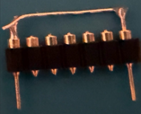


----

And that’s it, we now have our DIY-CRAP calibration kit for the Testboard prototype area. Now we can calibrate the NanoVNA in the prototype area and measure components through the female header pins.

## Our first experiment on the Testboard

Shopping list:
- ONE 22 Ω through-hole resistor
- ONE 22 µH through-hole inductor
- ONE 47 pF through-hole capacitor

Connect the two NanoVNA cables to the testboard ports.

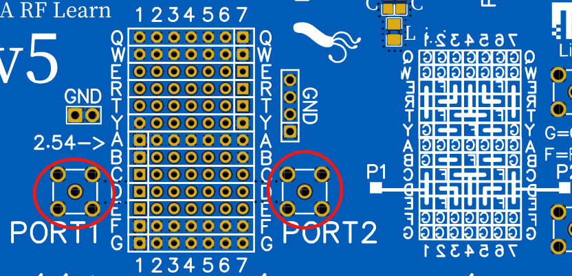

(on the right, you can see how the pins are connected to each other.)

Now calibrate 1MHz-12MHz: open, short, and load using our DIY-CRAP calibration kit. Connect each one between D1 and F1:

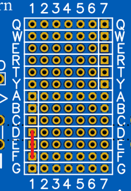

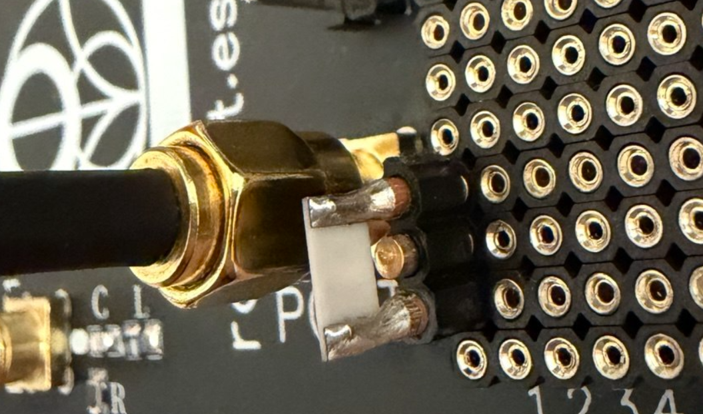

The thru step is very simple: insert the thru between D1 and D7.

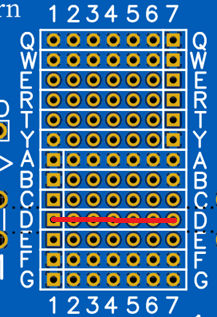

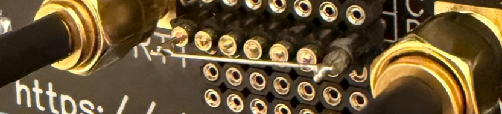

Keep the thru in the same position used during calibration, then connect the resistor, inductor, and capacitor in series to GND as follows:

- CAPACITOR: C1 -> Y2
- INDUCTOR: Y3 -> E5
- RESISTOR: R6 -> Q6

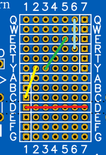

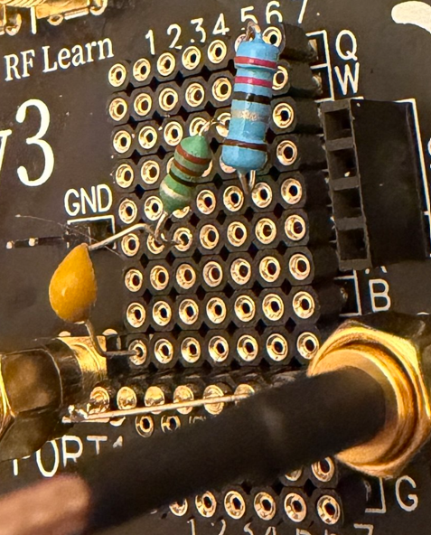

At this point, we have a series RLC circuit connected between GND and PORT1, while PORT1 is also connected to PORT2 through the thru.

If everything is connected correctly on the NanoVNA, you should see something like this:

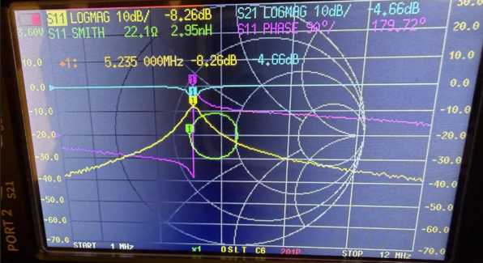

In this experiment three through-hole components an inductor, a capacitor and a resistor are connected **in series with each other** to form a single L–C–R branch. That branch is then wired as a **shunt to ground** between PORT1 and PORT2 of the NanoVNA. Connected this way, the network behaves as a **band-stop (notch) filter**: it passes almost everything except a narrow band around its resonant frequency, where it diverts the signal to ground.

### Where the resonant frequency comes from

Resonance happens when the inductive reactance and the capacitive reactance have equal magnitude and cancel each other out. The frequency at which this occurs is given by the series-resonance formula:

$$
f_0 = \frac{1}{2\pi\sqrt{LC}}
$$

where:

- $f_0$ is the resonant frequency in hertz
- $L$ is the inductance in henries
- $C$ is the capacitance in farads

At $f_0$ the two reactances cancel and the branch impedance collapses to just its series resistance. Because that branch sits in shunt, the low impedance shorts the signal to ground and creates the notch.

### Nominal vs. measured values

Using the **nominal** component values:

- $L = 22\ \mu H = 22 \times 10^{-6}\ H$
- $C = 47\ pF = 47 \times 10^{-12}\ F$

$$
f_0 = \frac{1}{2\pi\sqrt{(22 \times 10^{-6})(47 \times 10^{-12})}} \approx 4.95\ MHz
$$

But the parts were measured on an LCR meter and were not exactly nominal the inductor read **21.2 µH** and the capacitor **46 pF**. Using those **measured** values:

$$
f_0 = \frac{1}{2\pi\sqrt{(21.2 \times 10^{-6})(46 \times 10^{-12})}} \approx 5.10\ MHz
$$

This is almost exactly where the notch appears on screen (~5.2 MHz). The lesson: most of the gap between "theory" and "measurement" is simply **nominal vs. real component value** always measure your parts. And the small remaining difference is upward (5.235 MHz on screen versus 5.10 MHz predicted), which is a clue in itself: extra lead inductance or stray capacitance could only push the resonance down, so the leftover comes instead from the parts' effective values at 5 MHz differing slightly from what the LCR meter reads at its much lower test frequency, plus the sweep's marker resolution and the calibration's own residuals.

## Reading the NanoVNA screen

The capture is two-port sweep from **1 MHz to 12 MHz**, 201 points, after an **OSLT** calibration (Open–Short–Load–Through). Four traces are displayed:

- **S21 LOGMAG (cyan)** transmission, PORT1 → PORT2
- **S11 LOGMAG (yellow)** reflection at PORT1
- **S11 PHASE (magenta)** phase of the reflection
- **S11 SMITH (green)** input impedance on the Smith chart

The vertical scale is **10 dB per division**, with the **0 dB** reference line near the top.

### The marker

The marker sits at the resonant frequency and reads:

| Parameter | Value | Meaning |
|---|---|---|
| Frequency | 5.235 MHz | resonance |
| S21 | −4.66 dB | depth of the notch |
| S11 | −8.26 dB | reflection (rises here) |
| Smith | 22.1 Ω, 2.95 nH | input is essentially resistive |

The 2.95 nH is only ~0.1 Ω at this frequency, i.e. the residual reactance is practically zero confirming the L and C have cancelled.

### S21 the transmission notch

Away from resonance the L–C branch is a high impedance, so the signal passes straight through and **S21 stays near 0 dB**. At resonance the reactances cancel, the branch collapses to a low impedance, and it **diverts the signal to ground**, creating the dip at 5.235 MHz.

The notch depth (−4.66 dB) is set by the series resistance of the branch. A perfect short would give an infinitely deep notch; the resistor and the coil losses keep it finite. The series resistor used here (22 Ω) deliberately raises the branch impedance, which is why this notch is relatively shallow with the resistor removed, the branch is just the coil and capacitor losses and the notch deepens. **Lower branch resistance → deeper notch.**

And the numbers let you extract something real from that gap. If the branch were only the 22 Ω resistor, a 22 Ω shunt on a 50 Ω system would give S21 = 2Z/(2Z + Z0) ≈ −6.6 dB and S11 ≈ −5.5 dB. The screen shows a shallower notch (−4.66 dB) and a weaker reflection (−8.26 dB instead of −5.5 dB), and both disagreements point to the same culprit: at resonance the branch is really around 35 to 40 Ω, not 22 Ω. The extra 13 to 18 Ω is mostly the ESR of the inductor, plus the plug-in contacts. Since the coil's reactance at 5.2 MHz is about 700 Ω, that ESR corresponds to a Q of roughly 40 to 55, a perfectly normal figure for a small general-purpose choke. The gap between the textbook notch and the measured one is not an error to apologize for: it is the coil's Q, measured for free.

### S11 why reflection *increases* at resonance

This is the crucial and counter-intuitive part. Off resonance the shunt branch is high-impedance, the input sees the matched 50 Ω at PORT2, and **S11 is low (good match)**. At resonance the branch drops to its minimum impedance and loads the input down, the match degrades, and **S11 rises to −8.26 dB**.

But be careful reading the 22.1 Ω on the Smith chart, because that number is not the branch. PORT1 does not see the shunt branch alone: through the thru it also sees the 50 Ω of PORT2, so the input impedance is the branch in parallel with 50 Ω (Zin = Zbranch·50 / (Zbranch + 50)). Working backwards from the measured 22.1 Ω, the branch itself is about 40 Ω, and the measured S21 of −4.66 dB independently points to roughly 35 Ω. So the branch at resonance is not just the 22 Ω resistor: it is the resistor plus about 13 to 18 Ω of coil ESR and contact resistance. The on-screen 22.1 Ω landing so close to the 22 Ω resistor value is pure coincidence, and it is exactly the kind of coincidence that fools you into believing you measured the resistor directly.

At the notch, transmission drops and reflection rises but they do **not** add up to the full incident power, because this is a **lossy (absorptive) notch**: a real 22 Ω resistor sits in the branch. The power that no longer reaches PORT2 is split between what is **reflected** back to PORT1 (S11) and what is **dissipated as heat** in the resistor and the coil/contact losses. You can check it with the marker values themselves: |S21|² ≈ 10^(−4.66/10) ≈ 0.34 (≈34 % transmitted) and |S11|² ≈ 10^(−8.26/10) ≈ 0.15 (≈15 % reflected), so roughly **51 % of the power is absorbed**, not reflected. Only in a *lossless* network (no resistor) would everything that stops being transmitted come straight back as reflection.

### The Smith chart what the green loop means

The Smith chart maps **impedance onto reflection coefficient**:

- **Center** = 50 Ω, a perfect match (zero reflection)
- **Right edge** = open circuit; **left edge** = short circuit
- **Upper half** = inductive; **lower half** = capacitive

The green trace is the **locus of the input impedance as frequency sweeps**:

1. At the low- and high-frequency ends the branch is high-impedance, the input is ~50 Ω, and the trace sits **near the center**.
2. As the sweep approaches resonance, the shunt branch loads the input down and adds reactance, pulling the trace **outward in a circle**.
3. The loop **crosses the real (horizontal) axis at the marker**, where the impedance is purely resistive (**22.1 Ω**) exactly the resonant point.

**Why is it a circle?** The Smith chart plots reflection, not impedance. As frequency sweeps, the resonant branch is a straight vertical line in the impedance plane (constant R, with reactance swinging from capacitive through zero to inductive), and the Smith chart transform Γ = (Z−50)/(Z+50), the bilinear Möbius map turns straight lines into circles (a line is just a circle of infinite radius). One honest footnote to that argument: what the chart actually plots is the reflection of the input impedance, and the input is the branch in parallel with the 50 Ω of PORT2, not the branch alone. That does not break the circle, because the parallel combination is itself a Möbius map of the branch impedance, and composing Möbius maps gives another Möbius map, so the branch's vertical line still lands on the chart as a circle. A closed loop is the visual fingerprint of **one resonance**: the reactance crosses zero only once, at resonance. The loop shrinks toward the center as the series resistance grows the very same loss that makes the notch shallower.

### S11 phase

The magenta phase trace rotates rapidly through resonance, reading **179.72°** at the marker right at the ±180° wrap, consistent with the input being purely resistive and below 50 Ω there. A fast phase rotation across a narrow band is another classic signature of a resonator.

## Summary

| | Off resonance | At resonance (~5.2 MHz) |
|---|---|---|
| L–C branch | high impedance | low impedance (≈ series R) |
| S21 (transmission) | ~0 dB (passes) | notch (−4.66 dB) |
| S11 (reflection) | low (matched) | rises (−8.26 dB) |
| Smith trace | near center (~50 Ω) | swings out, crosses real axis (22.1 Ω) |

The measured notch at ~5.2 MHz matches the resonant frequency predicted from the measured component values, confirming both the theory and the build.

### A reality check: why this is "playing", not metrology

Before going further, it is worth being honest about what this Testboard setup really is. It is a **teaching and experimentation toy**, not a precision measurement system and that is perfectly fine, as long as you understand why.

Everything here works well at low frequencies (a few MHz), but becomes **questionable as the frequency rises**, for two separate reasons:

**1. The through-hole parts and the pins are not "ideal" components.** A real inductor, capacitor or resistor is only itself at low frequencies. As frequency goes up, the long legs of a through-hole part and the pins of the header start to act as small extra inductors, and the gaps between them act as small extra capacitors. These unwanted "parasitics" are a few nanohenries to a few tens of nanohenries and a picofarad or two, so you never notice them at 1 MHz, but their effect grows with frequency and eventually competes with the actual component you are trying to measure. A breadboard-style layout with springy contacts makes this worse: every contact adds a little resistance and inductance, and it changes slightly every time you re-plug the part. In short, **at high frequency you stop measuring your component and start measuring your component plus the whole messy fixture around it.**

**2. The DIY calibration kit defines where "perfect" is and ours is crap.** Calibration works by measuring three known references (open, short, load) so the instrument can mathematically subtract the cables and fixture and place its "measurement plane" at the pins. But the math can only be as good as those references. A commercial calibration kit has standards machined to known, characterised values. Our home-made open, short and load are approximate: the load is not exactly 50 Ω, the short has a little inductance, the open has a little capacitance, and none of them are characterised. At low frequency these imperfections are negligible and the calibration is excellent; at high frequency they matter more and more, so the "corrected" result drifts away from the truth.

**The takeaway for a complete beginner:** what we are doing is connecting real parts and watching how they behave, calibrated "well enough" to see the important effects resonance, filtering, impedance clearly and intuitively. It is a fantastic way to *understand* RF. But the exact numbers should be trusted only at the low end of the range, and treated as approximate as you go higher. If you ever need accurate high-frequency measurements, you need proper soldered fixtures (no breadboard, no long legs), characterised calibration standards, and ideally surface-mount parts. Here, we are playing and playing is how you learn.

A fair question: what does it even mean to "calibrate" at an SMA-to-breadboard transition, through female header pins and long through-hole legs? The coax and the SMA connectors are a controlled **50 Ω environment**, and the board's RF trace is *approximately* 50 Ω but the moment the signal leaves the trace and reaches the **header pins, that 50 Ω world ends**: a pair of springy pins with a component dangling off them is not a 50 Ω transmission line, it has no defined impedance at all, just stray inductance, stray capacitance and contact resistance, with whatever you plug in setting the impedance from there. So what does calibrating here buy us? By plugging our DIY open, short, load and thru into the **same pins** the component will use, we tell the NanoVNA to treat *that messy junction* as its new zero and subtract everything before it the cables, the connector and the trace. The trick is that we ask the instrument to **pretend those scruffy pins are a perfect 50 Ω reference** when they are not: we do not remove the error, we just shove it as close to the component as possible. And calibration only cancels what happens *up to* the pins it can do nothing about the long legs, the contact resistance and the stray parasitics *after* them, which now count as part of "your component". That is exactly why this is a toy for learning, not a lab fixture: good enough at the low end of each demo to see resonance, filtering and impedance clearly, but because that 50 Ω guarantee is gone the instant you reach the pins drifting further from the truth the higher in frequency you go.

### What is this realistically good for?

Testboard is a learning tool, not lab metrology and that is by design. With through-hole parts plugged into header pins and a DIY open/short/load/thru calibration, your readings are genuinely trustworthy from the NanoVNA-F V2's lower limit (around 50 kHz) up to a few tens of MHz. There is a concrete physical reason: component leads add roughly **1 nH of stray inductance per millimetre**, the springy header pins have no defined 50 Ω impedance, and home-made calibration standards drift the higher you go in frequency so the parasitics, not the NanoVNA, become the dominant error. Keep your leads short, re-calibrate whenever you change the frequency, and treat the numbers as a way to **learn RF**, not to certify hardware.

# Frequency Range and S-Parameters

The NanoVNA is a versatile vector network analyzer that can measure S-parameters (Scattering parameters) across a wide frequency range. S-parameters describe how RF signals behave in a network, such as reflection and transmission. The umsakazo board provides various components for testing, including resistors, capacitors, inductors, and attenuators.

# Measurement Frequency Ranges

| Demo | Frequency Range | Measurement Type |
|-----------|-----------------|------------------|
| 33 ohm | 1 MHz - 100 MHz | SWR S11 |
| 75 ohm | 1 MHz - 100 MHz | SWR S11 |
| -5 dB | 1 MHz - 9 MHz | S21 LOGMAG |
| -10 dB | 1 MHz - 9 MHz | S21 LOGMAG |
| C | 1 MHz - 250 MHz | SMITH S11 |
| L | 1 MHz - 100 MHz | SMITH S11 |
| RC Series | 1 MHz - 250 MHz | SMITH S11 |
| LC Series | 1 MHz - 30 MHz | SMITH S11 |
| RLC Series Parallel | 1 MHz - 800 MHz | SMITH S11 |
| RLC Parallel-Series | 1 MHz - 800 MHz | SMITH S11 |
| High Pass | 1 MHz - 40 MHz | S21 LOGMAG |
| Low Pass | 1 MHz - 80 MHz | S21 LOGMAG |
| SAW | 300 MHz - 460 MHz | S21 LOGMAG |
| Band Stop | 1 MHz - 9 MHz | S21 LOGMAG |


Note: you must calibrate your NanoVNA before performing measurements using the CAL zone.

Use outside of these ranges may not yield accurate results, just use it for fun and learning, not for precision measurements. 

Since each PCB and component set will be slightly different, I've left a white rectangle on each demo section where you can write or place a sticker with the exact frequency range that works best for your board. Variation between boards shouldn't be significant, but you may need to fine-tune the range slightly based on your specific components and PCB characteristics.

# S11 SMITH - CAPACITOR DEMO 


Just a capacitor connected to GND on one side and PORT1 on the other. You can use it to see how a capacitor behaves across different frequencies, and how it affects the S11 parameter on the Smith chart.

A capacitor to ground starts near the right side of the Smith chart because, at low frequency, its impedance is very high, so it behaves almost like an open circuit and reflects most of the signal. As the frequency increases, the capacitor impedance gets lower, so more signal is pulled to ground and the S11 trace moves clockwise along the lower outer edge, which is the capacitive region. The thick line ends closer to the left side because, in that part of the sweep, the capacitor is acting more and more like a short to ground. If the trace later bends or makes loops, that is usually caused by real-world parasitic inductance and resistance, not by an ideal capacitor.

# S11 SMITH - INDUCTOR DEMO


Just an inductor connected to GND on one side and PORT1 on the other. You can use it to see how an inductor behaves across different frequencies, and how it affects the S11 parameter on the Smith chart.

An inductor to ground starts near the left side of the Smith chart because, at low frequency, its impedance is very small, so it behaves almost like a short to ground. As the frequency increases, the inductor impedance becomes higher, so it pulls less signal to ground and the S11 trace moves through the upper part of the chart, which is the inductive region. The thick line ends closer to the right side because, at higher frequency, the inductor looks more and more like an open circuit. If the trace later bends or makes loops, that usually comes from real parasitic capacitance and resistance, not from an ideal inductor.

# S11 SMITH - RC SERIES DEMO


A resistor and capacitor in series between PORT1 and GND. You can use it to see how a simple RC series circuit behaves across different frequencies, and how it affects the S11 parameter on the Smith chart.

A capacitor in series with a 50 ohm resistor starts near the right side of the Smith chart because, at low frequency, the capacitor blocks the signal and the circuit looks almost like an open circuit. As the frequency increases, the capacitor reactance gets smaller, so the 50 ohm resistor becomes more visible to the source and the S11 trace moves through the lower part of the chart, which is the capacitive region. The thick line ends closer to the center because, in that part of the sweep, the capacitor is no longer blocking much and the circuit looks closer to a good 50 ohm match, so the reflection becomes smaller.

# S11 SMITH - LC SERIES DEMO


A capacitor and inductor in series between PORT1 and GND. You can use it to see how a simple LC series circuit behaves across different frequencies, and how it affects the S11 parameter on the Smith chart.

A series capacitor and inductor start near the right side of the Smith chart because, at low frequency, the capacitor dominates and the whole network looks almost like an open circuit. As frequency increases, the capacitive reactance gets smaller, so the trace moves along the lower outer edge until it reaches the left side, where the capacitor and inductor cancel each other and the circuit looks like a short circuit at resonance. Above that frequency, the inductor becomes dominant, so the trace continues through the upper outer edge and moves back toward the right side.

# S11 SMITH - RLC SERIES PARALLEL DEMO


Just a capacitor (100 pF) in series with a parallel combination of a resistor (50 Ω) and an inductor (68 nH), between PORT1 and GND. You can use it to see how a more complex RLC circuit behaves across different frequencies, and how it affects the S11 parameter on the Smith chart.

This network starts near the right side of the Smith chart because, at low frequency, the 100 pF series capacitor blocks the signal and the input looks almost like an open circuit. The inductor really is almost a short down there, but nothing gets past the capacitor to see it. As frequency climbs, the capacitive reactance shrinks and the trace slides clockwise along the capacitive rim. The dip toward the left side is a resonance, not the inductor acting as a short: by the time the capacitor lets the signal through, the 68 nH inductor is already around +j30 Ω, and what actually happens is that the inductive reactance of the parallel R and L branch cancels the capacitor's reactance, a damped series resonance. Without the 50 Ω resistor, the bare C and L would resonate at 61 MHz into a near-perfect short and slam the trace against the left rim. The resistor is what tames it: it caps the dip at roughly 14 Ω on the real axis (the trace's closest approach to the short side) and nudges the crossing up to about 72 MHz with ideal parts, so expect yours somewhere nearby. Above resonance the inductor's reactance keeps rising, so the parallel combination looks more and more like the bare 50 Ω resistor, while the capacitor is on its way to being a plain wire: the input converges on a clean 50 Ω and the trace curls back into the center.

# S11 SMITH - RLC PARALLEL-SERIES DEMO


A 50 Ω resistor in parallel with a branch made of a capacitor (220 pF) in series with an inductor (68 nH), the whole thing between PORT1 and GND. You can use it to see how a more complex RLC circuit behaves across different frequencies, and how it affects the S11 parameter on the Smith chart.

This network starts near the center of the Smith chart because, at low frequency, the 220 pF capacitor blocks the LC branch, so the input mainly sees the 50 Ω resistor to ground, which is a good match. As the frequency increases, the branch starts to conduct: below resonance it behaves like a capacitive shunt in parallel with the resistor, so the curve swings out through the lower half. At the series resonance of the branch, f0 = 1/(2π√(LC)) ≈ 41 MHz with these values, the capacitor and the inductor cancel each other and the branch collapses to just the coil's small ESR. And here is the twist that makes this demo the mirror of the previous one: this time the 50 Ω resistor cannot save the match, because the resonant branch sits in parallel with it and simply bypasses it, so the input is dragged down to roughly the coil's ESR (an ohm or so) and the trace reaches the left rim, a near-perfect short. Above resonance the branch turns inductive and its impedance rises again, so its shunting effect fades, the trace swings back through the upper half, and the input settles on the 50 Ω resistor again near the center. The full excursion draws the closed loop that is the fingerprint of a single resonance, the same one you saw in the Testboard RLC experiment. Same 50 Ω and 68 nH as the previous demo with a bigger capacitor, rearranged: there the resistor sat inside the branch and capped the dip at ~14 Ω; here it sits outside, gets bypassed, and the dip goes nearly all the way to the short.

# S11 SWR - 33 OHM & 75 OHM DEMO


Just a 33 ohm and 75 ohm resistor connected between PORT1 and GND. You can use them to see how different resistive loads affect the S11 parameter and the SWR (Standing Wave Ratio) on the NanoVNA.

A 75 ohm resistor and a 33 ohm resistor can both give about the same SWR in a 50 ohm system because SWR depends on how much the load differs from 50 ohms, not on whether the resistance is higher or lower. A 75 ohm load is above 50 ohms, so its point appears to the right of center, while a 33 ohm load is below 50 ohms, so its point appears to the left, but both are nearly the same distance from the center of the Smith chart. That means they produce nearly the same reflection magnitude, so the SWR is about 1.5 in both cases. Strictly speaking, the exact value symmetric to 75 ohms is 33.3 ohms, so 33 ohms is just a rounded practical example.

The SWR value of 1.5 comes from the reflection coefficient in a 50 ohm system. For a purely resistive load, the reflection coefficient is ((Z_L - 50)/(Z_L + 50)). With 75 ohms, this gives (25/125 = 0.2), and the SWR becomes ((1 + 0.2)/(1 - 0.2) = 1.5). A resistor below 50 ohms gives the same SWR if it creates the same reflection magnitude in the opposite direction. That is why 75 ohms and about 33.3 ohms are symmetric cases on the Smith chart: one is to the right of center, the other is to the left, but both are the same distance from the center, so both give the same SWR.

# S21 LOGMAG - HIGH PASS DEMO


Just connect PORT1 (left) to the input and PORT2 (right) to the output of the high pass filter demo on the umsakazo board. You can use it to see how a simple high pass filter behaves across different frequencies, and how it affects the S21 parameter in LOGMAG format on the NanoVNA.

This circuit is a third-order high-pass filter built as a pi network: a 100 pF capacitor in series, with a 680 nH inductor to ground on each side (the same two component values as the low-pass demo, with their roles swapped). With these values the −3 dB cutoff computes to about 14.5 MHz in a 50 Ω system, and that is why the S21 log magnitude curve starts low, rises through the transition region around that frequency, and then becomes nearly flat. The series capacitor is the main part that blocks low-frequency signals and lets higher-frequency signals pass, while the two shunt inductors help remove unwanted low-frequency energy by giving it a path to ground from both sides of the network. Using two inductors instead of just one makes the filtering stronger and cleaner, improves the shape of the response, and helps the filter behave better between the input and output ports. At low frequency, the capacitor is hard to pass through and the inductors load the signal, so very little reaches the output. As frequency increases, the capacitor becomes easier to pass through and the inductors stop pulling the signal down as much, so transmission increases. Once the signal is in the passband, the network no longer blocks it much, so S21 stays high and the trace looks almost flat.

# S21 LOGMAG - LOW PASS DEMO


Just connect PORT1 (left) to the input and PORT2 (right) to the output of the low pass filter demo on the umsakazo board. You can use it to see how a simple low pass filter behaves across different frequencies, and how it affects the S21 parameter in LOGMAG format on the NanoVNA.

This circuit is a third-order low-pass filter built as a pi network: a 680 nH inductor in series, with a 100 pF capacitor to ground on each side. With these values the −3 dB cutoff computes to about 25.6 MHz in a 50 Ω system, and that is why the S21 log magnitude trace starts high and flat through the passband, rolls off around that frequency, and finally becomes very low, with the slope steepening toward the 18 dB per octave of a third-order filter. The series inductor lets low-frequency signals pass more easily, but as frequency increases it starts to oppose the signal more and more, reducing transmission. At the same time, the two shunt capacitors give high-frequency energy a path to ground from both sides of the network, so less of that signal reaches the output. Using two capacitors instead of just one makes the filtering stronger, improves the shape of the response, and helps the filter behave better between the input and output ports. That is why low frequencies pass with little loss, while higher frequencies are increasingly attenuated.

# Band Stop Filter DEMO


Just connect PORT1 (left) to the input and PORT2 (right) to the output of the band stop filter demo on the umsakazo board. You can use it to see how a simple band stop filter behaves across different frequencies, and how it affects the S21 parameter in LOGMAG format on the NanoVNA.

This circuit is a band-stop, or notch, filter, so the S21 log magnitude trace starts high, drops sharply in the reject band, and then rises again after that frequency range. This band-stop is the very same circuit as the RLC experiment on the Testboard earlier in this document, just soldered down and with different values: a series R-L-C branch hanging in shunt from the line that joins the two ports. R3 (4.7 Ω), C8 in parallel with C9 (parallel capacitors simply add: 82 + 6.8 = 88.8 pF, a handy way to fine-tune a value out of standard parts), and L7 (6.8 µH) form a single branch from the signal line down to ground, while the main path from PORT1 to PORT2 is a plain through trace. Away from resonance the branch is a high impedance, so the signal passes and S21 stays high. At the series resonance, f0 = 1/(2π√(LC)) ≈ 6.5 MHz with these values, the reactances of the coil and the capacitors cancel, the branch collapses to just its resistance, and it diverts the signal to ground: that is the notch, sitting comfortably inside the 1 to 9 MHz sweep (component tolerances move it a little from board to board, which is exactly what the white rectangle is for). What is left of the branch at resonance, the 4.7 Ω of R3 plus a few ohms of coil ESR, sets the depth: R3 deliberately caps how deep the notch can go, which makes the demo repeatable instead of hostage to the ESR of each individual coil, and it makes the notch absorptive, so part of the stopped power is dissipated in the branch instead of all of it bouncing back at PORT1. Everything in the Testboard analysis, including why S11 rises at the notch and where the missing power goes, applies here unchanged.

# S21 LOGMAG - Band Pass 433MHz SAW DEMO 


Just connect PORT1 (left) to the input and PORT2 (right) to the output of the SAW filter demo on the umsakazo board. You can use it to see how a simple band pass filter behaves across different frequencies, and how it affects the S21 parameter in LOGMAG format on the NanoVNA.

This band-pass filter uses a SAW device, which means Surface Acoustic Wave. Inside it, the electrical signal is converted into a very small mechanical wave that travels across the surface, and then it is converted back into an electrical signal at the output. It works because the internal metal patterns are designed so that only a narrow range of frequencies creates the right acoustic wave and passes through efficiently, while frequencies above and below that range are strongly attenuated. That is why the S21 trace is low outside the passband, rises sharply in the wanted band, and then falls again. The main advantage of a SAW filter is that it gives very selective filtering in a very small part, so it is excellent for separating one RF band from nearby unwanted signals. It is widely used because it is compact, stable, and gives much better selectivity than a simple LC network of similar size.

How is this different from a band-pass built out of coils and capacitors, like the LC filters elsewhere on this board? Selectivity, and the Q needed to get it. A typical 433.92 MHz SAW (the ISM band of key fobs and cheap remotes) passes a band of a couple of MHz, well under one percent of fractional bandwidth: the ratio f0/bandwidth alone is already a loaded Q in the low hundreds, and for the passband not to drown in its own losses the resonators inside must be far better still. Small SMD inductors at 433 MHz offer a Q of maybe 30 to 100, so an LC copy of this filter would bury the signal in coil losses; getting there electromagnetically takes physically large air coils, or the coaxial and helical resonator cans you find inside old VHF/UHF radios. And resistors are no help at all: a resistor does not store energy, it burns it, so it cannot resonate, and narrow filtering is precisely a game of storing energy and exchanging it between an L and a C (or their acoustic equivalents). In filters, resistance only ever plays damping or termination, never selection: it is what caps how deep the band-stop demo's notch goes, and an RC network can shape a gentle slope but can never produce a narrow peak.

The ceramic filter you will find on similar demo boards (usually a 6.5 MHz or 10.7 MHz part, straight from the IF stages of old TVs and FM radios) is not a rival technology: it is a close cousin. Both are piezoelectric electromechanical filters. In both, the signal stops being electrical, lives briefly as a mechanical vibration with all the selectivity that mechanical resonance brings, and is converted back. The difference is where the vibration lives. In a ceramic filter, a small block of PZT ceramic vibrates in bulk, through its whole body, and the frequency is set by the block's physical dimensions, which is practical from a few hundred kHz up to around 10.7 MHz, classic IF territory. In a SAW, the wave travels only along the polished surface of the chip, launched and collected by interdigitated metal fingers printed by photolithography, and the frequency is set by the finger spacing. Sound in the substrate moves at a few km/s, roughly a hundred thousand times slower than a radio wave in air, so at 433.92 MHz the wavelength shrinks from 69 cm in air to about 7 to 9 µm on the chip, and the fingers are a couple of micrometres wide: easy work for lithography, impossible for a machined ceramic block. That is why low-MHz IF filters are ceramic, RF filters from tens of MHz to a few GHz are SAW, and the same family continues inside your phone as BAW and FBAR filters at even higher frequencies. The price of the double electrical-acoustic conversion is a few dB of insertion loss right in the middle of the passband, and you can see it on the NanoVNA: the top of the SAW passband sits visibly below 0 dB, while the LC filter demos on this board barely lose anything in theirs.

# Attenuator DEMO


Just connect PORT1 (left) to the input and PORT2 (right) to the output of the attenuator demo on the umsakazo board. You can use it to see how a simple attenuator behaves across different frequencies, and how it affects the S21 parameter in LOGMAG format on the NanoVNA.

These two circuits are resistive attenuators, and both are the classic symmetric pi (π) pad: one series resistor with a shunt resistor to ground on each side. The -5 dB version uses 30 Ω in series and two 178 Ω legs; the -10 dB version uses 71.5 Ω in series and two 97.6 Ω legs. Those are the textbook pi-pad values for a 50 Ω system, rounded to standard E-series parts: run the numbers and they give −4.97 dB and −9.96 dB of attenuation while presenting about 49.7 Ω and 50.5 Ω at the ports, which is why the source and load still see a good match. And being symmetric, they attenuate the same amount in both directions. Their S21 trace is almost a flat horizontal line because resistors do not filter one frequency more than another in the ideal case. The resistor in series reduces the signal that can go straight from input to output, and the two resistors to ground remove part of the signal energy while keeping the ports near the system impedance. In the -5dB version, only part of the signal is lost, which is why the line stays a little below the top. In the -10dB version, the direct path is reduced more and more energy is sent to ground, so the line appears lower. In simple terms, both circuits do the same job, but the second one throws away more signal than the first one.

# PCB Design Limitations

The umsakazo board is designed with simplicity and affordability as key priorities. The design philosophy focuses on:

- **Simple Bill of Materials (BOM)** - Common, readily available components that are easy to source
- **Cost-effective PCB** - Optimized for educational use without unnecessary complexity
- **Easy component replacement** - 0805 SMD components can be quickly swapped to experiment with different values and behavior
- **Accessible learning tool** - Designed for students and hobbyists to learn RF fundamentals without expensive equipment

This approach prioritizes hands-on learning and experimentation over precision, making the board an excellent platform for understanding RF concepts and component behavior.

The board uses 0805 SMD components, which are not ideal for high-frequency due to their parasitic effects.

The PCB design is not optimized for high-frequency measurements. As a standard FR4 board without strict impedance control, several factors affect measurement accuracy:

- **Parasitic effects** from the 0805 SMD components introduce unwanted inductance and capacitance
- **Board material** and trace routing introduce loss and phase shift
- **Lack of impedance matching** between components and traces
- **Component placement** affects signal integrity at higher frequencies

These limitations are inherent to the learning board design and should be considered when interpreting results, especially above the recommended frequency ranges. This is ideal for educational purposes and experimentation, not for precision RF measurements.

The coplanar waveguide design is used for the RF traces, which provides a simple and cost-effective way to route high-frequency signals on a PCB. However, it is not optimized for high-frequency performance, and the lack of proper impedance control can lead to signal degradation and inaccurate measurements at higher frequencies.

# DIY BNC CALIBRATION KIT 50 OHM

**WARNING**: THIS SECTION IS STILL UNDER CONSTRUCTION AND TESTING. THERE MAY BE ERRORS, INCORRECT MEASUREMENTS, ETC. FOR NOW, THIS IS JUST FOR MY OWN USE.

**NOTE 1**: values shown by the NanoVNA in formats such as R+L/C should be treated as **equivalent models**, not as proof of the exact physical parasitics of the standard.

**NOTE 2**: Using **electrical delay** can help move the reference plane and partially compensate adapters or extra connector length, but it does not magically remove all the non-ideal behavior of the standard. It is a practical aid, not a perfect correction.

In this section, I will document different attempts so you can build your own DIY MALE calibration kits with BNC connectors. The goal is for them to work up to 1 GHz.

Why not just buy a commercial calibration kit? Because they are expensive, and I want to learn how to make my own. Also, the DIY approach allows for customization and experimentation, which is valuable for learning.

Expensive DC–10 GHz (or more) calibration kits:

- Maury Microwave 8550CK10 ~6000€
- Fairview Microwave FMCK1024 ~8000€
- Pasternack PE5CK1024 ~9000€ 


These calibration kits are expensive because you are not just buying metal connectors, but precisely characterized standards. They can include data such as delay, parasitic capacitance or inductance, offset length, loss, or even full S-parameter files for each standard, so the VNA knows how the open, short, and load really behave across frequency. That data lets the VNA correct its own systematic measurement errors and produce much more accurate results.

**NOTE**: There is a cheaper option for 600 MHz:  "SDR-Kits BNC 4-pc Universal Calibration Kit" ~27€ (but I dont know if it is good or not, I have not tested it yet)

For the first tests, I calibrated the NanoVNA on the SMA connectors, then connected an SMA-to-BNC adapter to test the BNC connectors.


The SMA-BNC adapter I will use is the ADP-SMAF-BNCF from RF Solutions:


https://www.rfsolutions.co.uk/content/download-files/ADP-SMAF-BNCF-DATASHEET.pdf

| Feature | Specification |
|---------|---------------|
| Frequency Range | DC-3GHz |
| Voltage Standing Wave Ratio | ≤1.15 |
| Impedance | 50Ω |
| Temperature Range | -55~+155oC |
| Centre Conductor Retention Range | ≥0.28N |
| Coupling nut Retention Force | ≥180Nq |
| Insertion Loss | ≤0.1dB/3GHz |
| Durability (mating) | >500 Cycles |
| Insulation Resistance | ≥5000MΩ |
| Working Voltage | 355Vrms |
| Max Voltage (can withstand) | 1000Vrms |

An electronic delay of about 225 ps will be used on the NanoVNA to extend the reference plane.

Before any numbers, one thing has to be said, because it sets the error floor for this whole section. The electrical delay only rotates the phase of the reference plane: it does not remove the adapter's own mismatch or its loss. The ADP-SMAF-BNCF is specified at VSWR ≤ 1.15, which means the adapter alone can contribute a reflection of up to |Γ| ≈ 0.07, i.e. a return-loss floor of roughly −23 dB. Every return loss measured on a 50 Ω load in this section (all between about −21 and −29 dB) sits within a couple of dB of that floor or below it. Two consequences follow. First, at these levels the adapter's reflection adds vectorially to the load's, so a few dB of difference between two good loads is inside the error of the setup and cannot rank them. Second, a reading deeper than the floor (like −28.9 dB at 316 MHz) can simply mean the adapter's error happened to partially cancel the load's reflection at that frequency, not that the load is that good. Everything below should therefore be read as "this load as seen through this adapter", never as the load's own datasheet number.

I calibrated from 100 MHz to 1 GHz.

First, we will measure a higher-quality and more expensive 50-ohm RF load than what should result from our DIY kit: 65_BNC-50-0-6/113_NE from HUBER+SUHNER.


https://www.hubersuhner.com/Asset/eyJpZGVudGlmaWVyIjo3ODgyNCwidHlwZSI6ImFzc2V0In0/Hee_P8STgA3T8IfP/H%2BS_65_BNC-50-0-6113_N_EN.PDF

| Feature | Specification |
|---------|---------------|
| Impedance | 50Ω |
| Operating frequency | 0 GHz ... 4 GHz |
| VSWR | 1.15 |
| Return loss | 23.1 dB |

Electrical Data (frequency related):

| Frequency range | VSWR max |
|---------|---------------|
| 0 GHz to 3 GHz | 1.1 |
| 3 GHz to 4 GHz | 1.15 |


------

We are not using THRU calibration for this section, but I keep these THRU adapters on hand for when I need them:

BNC FEMALE-FEMALE R141704000 from Radiall:

http://radiall-files.s3.amazonaws.com/tds/coaxialconnectors/R141704000%20C.pdf


| Parámetro                      | Valor                          |
|--------------------------------|--------------------------------|
| Impedance                      | 50 Ω                           |
| Frequency                      | 0–4 GHz                        |
| VSWR                           | 1.25 + 0.0000 × F(GHz) Max     |
| Insertion loss                 | 0.115 × √F(GHz) dB Max         |
| RF leakage                     | -(57 - F(GHz)) dB Max          |
| Voltage rating                 | 500 Veff Max                   |
| Dielectric withstanding voltage| 1500 Veff min                  |
| Insulation resistance          | 5000 MΩ min                    |

------

BNC MALE-MALE R141703000 from Radiall:

https://www.radiall.com/download/ds/index/f/aHR0cHM6Ly9yYWRpYWxsLWZpbGVzLnMzLmFtYXpvbmF3cy5jb20vdGRzL2NvYXhpYWxjb25uZWN0b3JzL1IxNDE3MDMwMDAgVi5wZGY~/


| Parameter | Value | Notes |
|-----------|-------|-------|
| NOMINAL IMPEDANCE | 50 | Ω |
| FREQUENCY RANGE | 0-4 | GHz |
| TEMPERATURE RATING | -65/+165 | °C |
| V.S.W.R | 1.25 + | x F(GHz) Maxi |
| RF INSERTION LOSS | 0.115 √F(GHz) | dB Maxi |
| VOLTAGE RATING | 500 | Veff Maxi |
| DIELECTRIC WITHSTANDING VOLTAGE | 1500 | Veff Mini |
| INSULATION RESISTANCE | 5000 | MΩ Mini |
| MECHANICAL DURABILITY | 500 | Cycles |

------

BNC FEMALE-MALE PE9269 from Pasternack:

https://www.pasternack.com/images/ProductPDF/PE9269.pdf


| Description | Minimum  | Maximum | Units |
|-------------|--------- |---------|-------|
| Frequency Range | DC  | 4 | GHz |
| VSWR | |1.3:1 |    |
| Operating Voltage (AC)   | | 500 | Vrms |

------


## 65_BNC-50-0-6/113_NE with e-delay, at 1 GHz:


56,2 ohm 23.0pF -21,16 dB 

-----

## 65_BNC-50-0-6/113_NE with e-delay, at 604 MHz:


51,6 ohm 45.2pF -24,53 dB

-----

## 65_BNC-50-0-6/113_NE with e-delay, at 316 MHz:


49,4 ohm 143pF -28,89 dB

-----

## DIY MALE LOAD

Aliexpress RF 50 ohm BNC Panel Mount:


Cut off the protruding part with a Dremel:


Sand it down to remove the protruding part (I’m not sure this was a good idea for the short and the open...):


Then make a LOAD, a SHORT, and an OPEN:


Soldering to the outer part is difficult: patience, flux, and heat are required...

The load uses 3 RESI PTFR0603A150RP9 0603 thin-film resistors of 150 ohms ±0.05% in parallel, giving 50 ohms:

https://www.lcsc.com/datasheet/C19683979.pdf

The reason for using three in parallel and thin film is to try to reduce parasitic inductance, although I’m not sure whether I achieved that...

The result is pretty ugly and questionable xD, but it’s the first attempt:


## Low-frequency 4-wire/Kelvin LCR sanity check with DE-5000:

Low-frequency 4-wire/Kelvin LCR sanity check
Measured with a DE-5000 at 1 kHz using the TL-22 4-wire SMD tweezers. The DIY load measured 49.99 Ω with 0.0° phase, confirming that it behaves as an essentially ideal 50 Ω resistive load at low frequency.


-----

## DIY MALE LOAD with e-delay, at 1 GHz:


52,8 ohm 52.9pF -27.98 dB

-----

## DIY MALE LOAD with e-delay, at 604 MHz:


50,7 ohm 48.2pF -25.24 dB

-----

## DIY MALE LOAD with e-delay, at 316 MHz:


49,5 ohm 140pF -28.78 dB

-----

## Shorts

## Short BNC Male R141862000 from Radiall

https://www.mouser.es/datasheet/3/512/1/R141862000%20V.pdf


## SHORT R141862000 from Radiall with e-delay, at 1 GHz:


-106 mohm 477pH 0.04 dB

-----

## SHORT R141862000 from Radiall with e-delay, at 604 MHz:


-41.3 mohm 166pH  0.01 dB

-----

## SHORT R141862000 from Radiall with e-delay, at 316 MHz:


-9.85 mohm 16.0pH 0 dB

-----

## Aliexpress BNC Male Short


## AliExpress short with e-delay, at 1 GHz:


120 mohm 554pH -0.04 dB

-----

## AliExpress short with e-delay, at 604 MHz:


97.8 mohm 226pH -0.03 dB

-----

## AliExpress short with e-delay, at 316 MHz:


151 mohm 89.1pH -0.04 dB

-----

## Open SC2008 BNC Male Open Circuit de Fairview Microwave


https://www.fairviewmicrowave.com/content/dam/infinite-electronics/product-assets/fairview-microwave/product-datasheets/SC2008.pdf?srsltid=AfmBOook1h7uDH7ZRd-_MdugQZYOZbGFYhvBcQH1GOCpUhCFNz_ZfDrP

The results are basically the same as leaving it open in air with nothing attached, so there is no point in adding more photos or information. Obviously, this is not a calibration open; it is meant to keep dust out of a BNC connector xD.

## My DIY MALE Open and DIY MALE Short were terrible

I must have done something wrong, maybe while soldering, sanding... or something else.

## Terrible DIY MALE OPEN 


At 604 MHz with e-delay: 10.9 ohms and 1.53 pF -0.29 dB

-----

## Terrible DIY MALE SHORT


At 604 MHz with e-delay: 9.38 ohms and 3.70 nH -3.04 dB

------

So it is better to use the SC2008 as OPEN (or nothing), and the AliExpress BNC short.

## Better DIY MALE OPEN & SHORT - second attempt

We deserve a better DIY male open & short, second attempt.

I bought some typical PCB-mount BNC male connectors from AliExpress and eBay. Using pliers and scissors, I removed the protruding pins as best I could. I didn't sand them or do anything else, so they aren't perfectly flush.


Here's how the open looks:


And here are the shorts:


Note: You'll need heat and patience to solder well to the outer shell.

The open... meh... I'm still not happy with it:


The short is better than the previous disaster, but I still don't like it (especially compared to the AliExpress short):


At 604 MHz with e-delay, the short measures 172 mΩ, 1.92 nH, and -0.06 dB.

## DIY MALE BNC Kit Conclusions

### The DIY MALE Load works remarkably well

The three 150 Ω thin-film 0603 resistors, soldered in a star pattern directly onto the BNC panel-mount connector, produce results very close to the HUBER+SUHNER 65_BNC-50-0-6/113_NE commercial load up to 600 MHz. At 316 MHz, the DIY load measures 49.5 Ω versus 49.4 Ω for the commercial reference; at 604 MHz, it measures 50.7 Ω versus 51.6 Ω. Even at 1 GHz the DIY load is still surprisingly close (52.8 Ω vs 56.2 Ω), although at this frequency the measurement is dominated by the SMA-BNC adapter and the residual e-delay error, so the two numbers should be read as "both in the same ballpark", not as a real ranking between the loads. Do not read anything into the equivalent capacitance values the NanoVNA displays here (52.9 pF versus 23.0 pF at 1 GHz, or the roughly 140 pF both loads show at 316 MHz): with reflections this small, those equivalent capacitance values are numerically unstable residuals of the adapter and the e-delay (a leftover reactance of a few ohms re-expressed as a big pF figure), exactly the warning in NOTE 1 above, and they are not properties of the loads; the equivalent series resistance moves much more smoothly, which is why the ohm values are the part worth comparing. The return losses themselves are −27.98 dB for the DIY load versus −21.16 dB for the commercial one, and since both sit at or near the adapter's own error floor, that difference does not rank the two loads in either direction. For me, this is the main win of the project: 

Up to ~600 MHz, this ~3 EUR DIY load is indistinguishable through this measurement setup from a >30 EUR commercial 50 Ω reference (4 GHz, VSWR ≤1.15): 49.5 Ω vs 49.4 Ω at 316 MHz, and 50.7 Ω vs 51.6 Ω at 604 MHz, with both loads sitting at or under the setup's own error floor. That close agreement at HF/VHF/low-UHF is the real win here. At 1 GHz the DIY load still looks good, but at that point the adapter and e-delay residuals dominate the measurement, so I would not claim it matches or beats the commercial load there only that it stays in the same ballpark.

### The DIY MALE Short and Open were a failure

At first I blamed the Dremel work for destroying the RF geometry, but the numbers say otherwise. A geometry error is reactive: it shifts inductance and capacitance and rotates phase, but it does not eat power. What I measured is loss. The short returned only −3.04 dB, i.e. |Γ|² ≈ 0.5, so half of the incident power was being absorbed by a part whose only job is to reflect all of it, and it showed about 9.4 Ω of series resistance. The open, which should look like a small fringing capacitance and nothing else, showed about 11 Ω in series with its 1.5 pF. Series resistance of that size in a one-piece metal part is not geometry, it is bad metal-to-metal contact: a cold or poorly wetted joint to the connector shell, plus sanding debris and flux residue around the dielectric. The 3.7 nH of the short is the geometric part (a long, thin return path through a marginal joint), but the ohms, the thing that actually wrecked these standards, live in the joints. That is consistent with the second attempt below: the improvement came from cleaner, properly heated joints to the shell and from skipping the sanding, not from more precise cutting. 

### Cheap commercial shorts are good enough

The AliExpress BNC male short measured 97.8 mΩ / 226 pH at 604 MHz and 120 mΩ / 554 pH at 1 GHz.

### Open standard: just leave the connector open

The Fairview SC2008 BNC open-circuit cap showed no meaningful difference compared to leaving the connector open with nothing attached. For this DIY setup, leaving the connector open was the cheapest and most practical open.

### Recommended budget DIY MALE BNC calibration kit

| Standard | Solution | Approx. cost |
|----------|----------|-------------|
| LOAD | BNC panel-mount (DC–1GHz or more) + 3 × 150 Ω 0603 thin-film PTFR0603A150RP9 in star | ~3 EUR |
| SHORT | BNC male short from AliExpress | ~2–3 EUR |
| OPEN | Nothing (air) | 0 EUR |
| SMA-BNC adapter | ADP-SMAF-BNCF or equivalent (DC–3 GHz) | ~5 EUR |
| **Total** | | **~10–15 EUR** |

If your goal is learning, debugging, comparing parts, checking cables, and doing affordable RF experiments, this DIY BNC kit is useful.

If your goal is accurate calibration with known standard parameters, then a proper commercial calibration kit is still the choice.

# EXPERIMENT WITH DIY MALE BNC CALIBRATION KIT

Now let's do the opposite: we will calibrate the NanoVNA from scratch using our DIY BNC kit (first attaching the SMA-BNC adapter), and then measure the NanoVNA's SMA calibration kit to see how it performs. (After calibrating, we'll need to add an SMA-BNC adapter (+edelay) to connect the short, load, and open standards from the SMA calibration kit.)

So, for CALIBRATION, we will use:

NanoVNA SMA -> ADP-SMAF-BNCF -> DIY BNC CALIBRATION KIT

So, for MEASUREMENT, we will use (+edelay):

NanoVNA SMA -> ADP-SMAF-BNCF -> ADP-SMAF-BNCM -> SMA CALIBRATION KIT


**NOTE:** Cross-check: calibrating with the DIY BNC kit and then measuring an independent SMA kit gives a practical consistency check, but this is not a formal validation because adapters and standard re-measurement limit the interpretation.

We will calibrate from 100 MHz to 1 GHz using the DIY MALE BNC kit with the SMA-BNC adapter ADP-SMAF-BNCF.

- LOAD: DIY BNC MALE 50 OHM
- SHORT: BNC SHORT ALIEXPRESS 
- OPEN: AIR

After calibrating in the BNC world, we will add a new ADP-SMAF-BNCM adapter from RF Solutions 


https://docs.rs-online.com/5e2e/A700000008303676.pdf

| Electrical Data | Detail |
|---|---|
| Impedance | 50 Ω |
| Frequency Range | 0 to 4 GHz |
| VSWR | ≤ 1.3 : 1 |
| Insulation Resistance | 5 000 MΩ min. |
| Voltage Rating | 500 V RMS |

| | Connector A | Connector B |
|---|---|---|
| Contact Resistance, Center | 2.0 mΩ max. | 2.0 mΩ max. |
| Contact Resistance, Outer | 2.0 mΩ max. | 2.0 mΩ max. |
| Insertion Loss | 0.06 dB max. x √f GHz | 0.2 dB max. @ 3 GHz |
| RF Leakage | -60 dB min. @ 3 GHz | -55 dB min. @ 3 GHz |

Next, we will adjust the electrical delay (edelay) 200 ps so that the reference plane is set at the tip of the ADP-SMAF-BNCM adapter.

Why do we add the ADP-SMAF-BNCM? This allows us to connect the NanoVNA's SMA calibration kit and check whether the short, open, and load standards behave the same as if we had calibrated directly with the SMA connector.

------

CAL OPEN (AIR)

------

CAL SHORT (ALIEXPRESS):


------

CAL LOAD (DIY MALE LOAD):

 

------

Add the ADP-SMAF-BNCM adapter:


------

Adjust the edelay to 200 ps.

------

NanoVNA SMA SHORT CALIBRATION KIT:


------

NANOVNA SMA LOAD CALIBRATION KIT:


# Design Files and Documentation

This PCB is released under the MIT License. All design files will be made available in the repository by the end of 2027. The repository will include:

- **Gerber files** - For PCB manufacturing
- **PCB layout files** - Complete board design
- **Pick & Place files** - Component placement coordinates for assembly
- **Bill of Materials (BOM)** - Complete list of components with part numbers
- **Schematic files** - Detailed electrical schematics

You are welcome to use these files to manufacture your own board, modify the design to suit your specific requirements, or adapt the project for educational and commercial purposes, as permitted by the MIT License.

# Future Improvements and Community Release

During 2026 and 2027, I will continuously optimize the Bill of Materials (BOM) to reduce costs while maintaining quality. **The final production release will be published once we achieve optimized component sourcing and cost-effective pricing.** Currently, material costs are higher than target, and we are working with suppliers to bring these down before the community release.

We welcome feedback from early adopters and users to enhance both the design and documentation. If you have suggestions, please open an issue. The final version will reflect community input and market-driven improvements to deliver maximum value.

If you would like to explore different design directions, feel free to fork the project and create your own version.

# Greetings

Gonzalo Carracedo @BatchDrake & Carlos Cabezas @EB4FBZ, who are true RF experts, and from whom I always learn so much through their critiques, comments, and conversations in the HardwareHackingES Telegram channel.

# Learn 

- https://onlinesmithchart.com/

## Video 

- Resonance in AC Circuits Visualised | Series RLC Circuit, Resonant Frequency & Q Factor by Decipher Physics: https://www.youtube.com/watch?v=og6KsSDd644
- Impedance & Reactance (Full Visual Explanation) by Decipher Physics: https://www.youtube.com/watch?v=akVP_TF7jDI
- Why AC Circuits Don't Obey Ohm's Law (The Reality of Reactance) by Prof MAD: https://www.youtube.com/watch?v=Zk3HnuQthis
- How to properly use a NanoVNA V2 Vector Network Analyzer & Smith Chart (Tutorial) by  Andreas Spiess: https://www.youtube.com/watch?v=_pjcEKQY_Tk
- Inverted-F PCB Antenna: How to tune PCB circuits using a NanoVNA by HB9BLA Wireless: https://www.youtube.com/watch?v=rbXq0ZwjETo
- PCB Controlled Impedance by Phil's Lab: https://www.youtube.com/watch?v=aNYmOIMt7CY 
- What Effects Do Transmission Lines Have? by W0QE: https://www.youtube.com/watch?v=6458gZavAug
- What Effects Do Different Components Have? by W0QE: https://www.youtube.com/watch?v=79jbor_T9PU
- Back to Basics: What is a VNA / Vector Network Analyzer by w2aew: https://www.youtube.com/watch?v=Sb3q8f0NBZc
- NanoVNA Port Extension using the Electrical Delay setting by w2aew: https://www.youtube.com/watch?v=bEPUePy_buM
- NANOVNA Made Simple by IMSAI Guy: https://www.youtube.com/watch?v=QJYeFpiqY8c
- NANOVNA making BNC VNA calibration set by  IMSAI Guy: https://www.youtube.com/watch?v=I0kIH492DcY
- Building VNA Calibration Loads by W0QE: https://www.youtube.com/watch?v=NSAQ2iQNX2I
- The Reference Plane by W0QE: https://www.youtube.com/watch?v=xLGSblc-Fec
- Building VNA Calibration Loads - Revisited by W0QE: https://www.youtube.com/watch?v=-PK9Bn7Ixnw
- Transmission Line Terminations for Digital and RF signals - Intro/Tutorial by w2aew: https://www.youtube.com/watch?v=g_jxh0Qe_FY
- Smith Chart: Z, VSWR, Reflection Coef and Transmission Line Effects by w2aew: https://www.youtube.com/watch?v=ImNRca5ecF0
- Basics of the Smith Chart - Intro, impedance, VSWR, transmission lines, matching by w2aew: https://www.youtube.com/watch?v=TsXd6GktlYQ
- Why a VNA needs to be calibrated | how to calibrate a nanoVNA by w2aew: https://www.youtube.com/watch?v=x-tbvAbh9jk
- Use NanoVNA to measure coax length - BONUS Transmission Lines and Smith Charts, SWR and more by w2aew: https://www.youtube.com/watch?v=9thbTC8-JtA
- Debunking SWR Myths Once and For All! by TheSmokinApe Ham Radio: https://www.youtube.com/watch?v=5z6VnWC6V2g
- Understanding VNAs - Antenna Measurements by Rohde & Schwarz: https://www.youtube.com/watch?v=15-hd_JjmYY
- Understanding VSWR and Return Loss by Rohde & Schwarz: https://www.youtube.com/watch?v=BijMGKbT0Wk
- Understanding the Smith Chart by Rohde & Schwarz: https://www.youtube.com/watch?v=rUDMo7hwihs
- Understanding S Parameters by Rohde & Schwarz: https://www.youtube.com/watch?v=-Pi0UbErHTY 
- Understanding VNA Calibration Basics by Rohde & Schwarz: https://www.youtube.com/watch?v=bLfbg2p7PaE
- Understanding VNAs - Segmented Sweeps by Rohde & Schwarz: https://www.youtube.com/watch?v=XP4QBpu9MO0 
- Understanding VNAs - Cable Loss Measurements by Rohde & Schwarz: https://www.youtube.com/watch?v=xqLQH0eWs3E  
- Understanding VNAs - Cable Impedance Measurements by Rohde & Schwarz: https://www.youtube.com/watch?v=SaCH3Z7veNc
- nanoVNA - Alligator Clip Leads vs. VNA Test Fixture Kit - Measuring Inductors & Capacitors by Gregg Messenger - VE6WO: https://www.youtube.com/watch?v=Y2_aytTVvFw
- Alligator Test Leads and the NanoVNA by TheSmokinApe Ham Radio: https://www.youtube.com/watch?v=gzmrueSXteE
- NanoVNA 75 Ohm Calibration by The Volpe Firm, Inc: https://www.youtube.com/watch?v=X2a31PExqM0

## Doc

- Measurement and Application of Scattering Parameters in RF-Design by PROF. DR. THOMAS BAIER: [stuff/doc/HamRadio DG8SAQ 2013 English](stuff/doc/HamRadio_DG8SAQ_2013_English.pdf)
- RF engineering basic concepts: the Smith chart by F. Caspers - CERN, Geneva, Switzerland: [stuff/doc/p95.pdf](stuff/doc/p95.pdf)
- How to design your own BNC Female calibration Kit with verified performance:  [stuff/doc/How_to_design_your_own_BNC_Female_calibration_Kit_with_verified_performance.pdf](stuff/doc/How_to_design_your_own_BNC_Female_calibration_Kit_with_verified_performance.pdf)
- Characterizing a SMA calibration kit by Mario Hellmich: https://www.mariohellmich.de/projects/sma-cal-kit/sma-cal-kit.html

# People to follow 

- @therealdreg https://x.com/therealdreg
- https://www.youtube.com/@hardwarehackinges
- Gonzalo Carracedo @BatchDrake https://x.com/BatchDrake
- Carlos Cabezas @EB4FBZ https://x.com/eb4fbz
- Mehdi @MehdiHacks https://x.com/MehdiHacks
- https://www.youtube.com/@DecipherPhysics
- https://www.youtube.com/@AndreasSpiess
- https://www.youtube.com/@HB9BLA
- https://www.youtube.com/@w2aew
- https://www.youtube.com/@IMSAIGuy
- https://www.youtube.com/@TheSmokinApe
- https://www.youtube.com/@w0qe
- https://www.youtube.com/@ve6wo


