# umsakazo
NanoVNA RF Learning board - RF demo kit SMA training (All MIT License, design files will be released by the end of 2027)

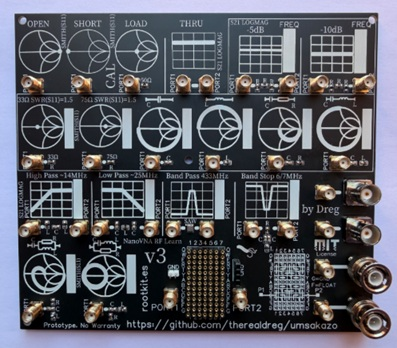

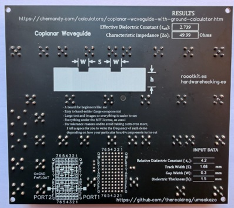

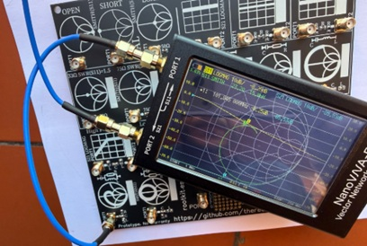

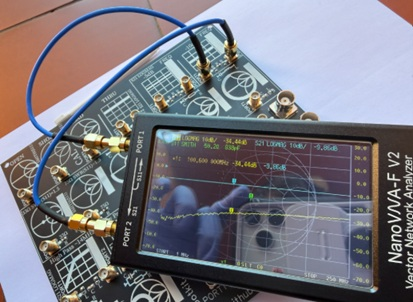

-------

Here’s an introductory **VIDEO** DEMO on how to use the UMSAKAZO board:

[https://youtu.be/kYVsM9EE5ec 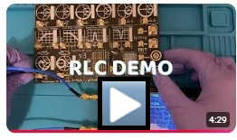](https://youtu.be/kYVsM9EE5ec)

-------

# You can now buy it at [https://www.rootkit.es 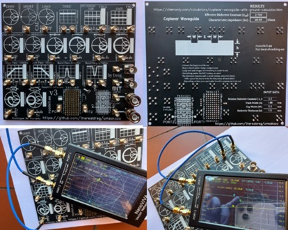](https://www.rootkit.es/) 

## **Available in July 2026**

-------

# Story behind the project

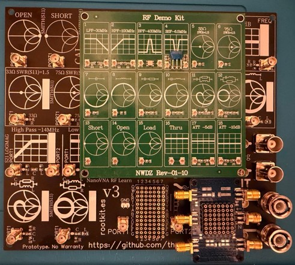

The famous green "RF Demo Kit for NANOVNA" board with UFL connectors was a pain to use with students in my hardware hacking bootcamps. On top of that, you can't make many connections and disconnections without breaking something. That's why I decided to design this demonstration board with SMA connectors. 

It's more robust, easier to use and solder, and allows experimenting with different components and configurations to learn about RF and NanoVNA usage.

I also incorporated the concept from the famous "NanoVNA Testboard Kit," but with a larger prototyping area to fit more components.

I built everything pretty much from scratch in my own way. I hope you like the idea.

Additionally, the board comes fully assembled with high-quality 0805 SMD components (C0G, thin film... without exceeding the target price).

Being larger with more components, including more expensive components and through-hole parts, and more soldering required, the board is naturally more expensive.

If you look for a cheap SMA alternative, check this project by IMSAI Guy, but you need transplant components from the original UFL board: https://www.youtube.com/watch?v=2W0pjMk56rA

Btw, the IMSAI Guy's board is better from the point of view of RF performance, but umsakazo is designed for learning and experimentation, not for precision measurements, so I prioritized ease of use and component accessibility over high-frequency performance.

## Why umsakazo name? 

umsakazo means radio in Zulu (South Africa)

# Getting Started with NanoVNA and umsakazo

Learn how to use NanoVNA and some electronics from scratch with umsakazo, the NanoVNA RF Learning board (RF demo kit SMA training). This tutorial will guide you through the basics of using a NanoVNA, understanding S-parameters, and performing simple measurements with the umsakazo board.

This documentation is written for the **AURSINC NanoVNA-F V2 50KHz-3GHz**

Assume you have the latest firmware installed and everything configured by default, as it comes from the factory.

Reset using Tera Term or any serial terminal:

```
ch> clearconfig 1234
Config and all cal data cleared.
ch> saveconfig
Config saved.
ch> reset
Performing reset
```

Now disconnect NanoVNA from the computer and power off, then power it on again to start with a clean slate. Repeat power-off and power-on two times to ensure all settings are reset.

# Your first demo: SMITH S11 - RC Series


First, press on the right side of the screen to enter the NanoVNA main menu.

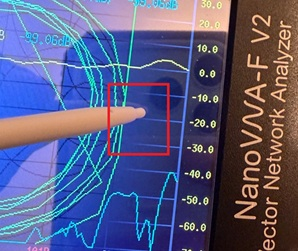

Select "Stimulus" to configure the frequency range.

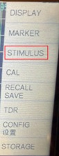

Select "Start/Stop" to set the frequency range for your measurements (1 MHz - 250 MHz for the RC Series demo).

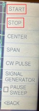

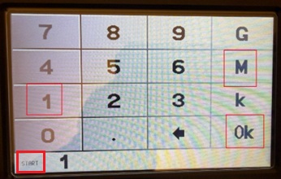

After clicking OK, press the right side of the screen to access the menu again, then select "Stop" to set the stop frequency range:

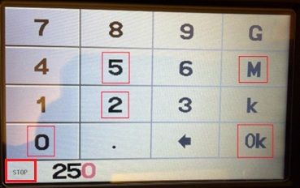

Press on the right side of the screen to enter the NanoVNA menu.


Select "Back" to return to the main menu.

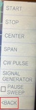

Select "CAL" to enter the calibration menu.

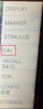

Select "Reset CAL" to clear any previous calibration data (it is important to start with a clean slate for accurate measurements).

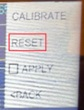

Select "Calibrate" to start the calibration process.

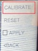

Connect PORT1 to the "Open" calibration standard on the umsakazo board, then select "Open" on the NanoVNA screen to perform the open calibration step.

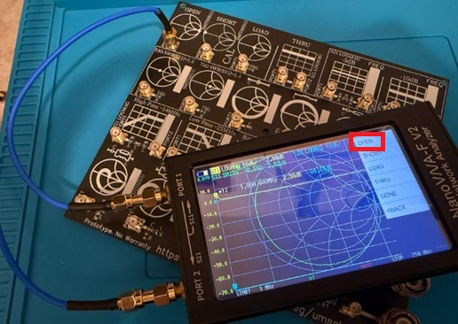

Next, connect PORT1 to the "Short" calibration standard on the umsakazo board, then select "Short" on the NanoVNA screen to perform the short calibration step.

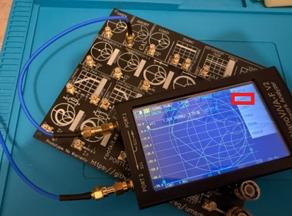

Next, connect PORT1 to the "Load" calibration standard on the umsakazo board, then select "Load" on the NanoVNA screen to perform the load calibration step.

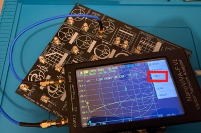

Next, connect PORT1 (left) and PORT2 (right) to the "Thru" calibration standard on the umsakazo board, then select "Thru" on the NanoVNA screen to perform the thru calibration step.

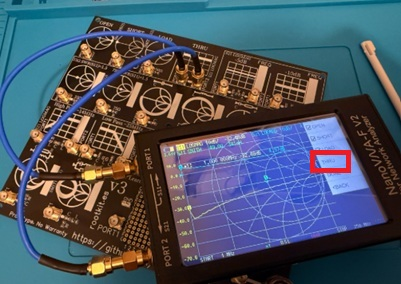

Select "Done" to complete the calibration process.

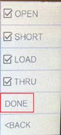

Select SAVE 0 to save your calibration.

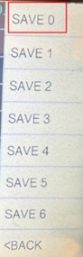

Select "S11 SMITH" from the top-left corner of the screen to display the S11 parameter on the Smith chart. The S11 green rectangle should be selected.

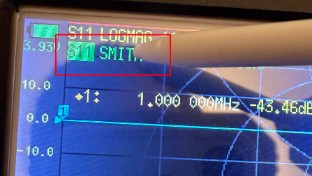

Connect the RC Series demo component on the umsakazo board to PORT1, and you should see the S11 response on the Smith chart.

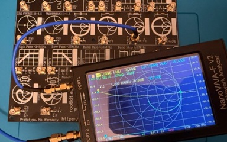

In an RC series circuit, the impedance changes with frequency. At low frequencies, the capacitor acts as an open circuit (right). As frequency increases, the capacitor's reactance decreases, allowing current to flow more easily, and the impedance moves toward the 50-ohm center point. Since the 50-ohm resistor remains constant (aprox) while the capacitor's reactance decreases with frequency, the impedance traces a semicircle from the open-circuit point toward the ~50-ohm point.

Note: not all time is exactly 50 ohms, as the components and PCB design introduce variations, but you should see the general behavior of the RC series circuit on the Smith chart.

Now, you can use the cursor 1 to analyze the response. Press on the 1 cursor to select it, then use stick to move it around the Smith chart and observe how the S11 parameter changes with frequency. 

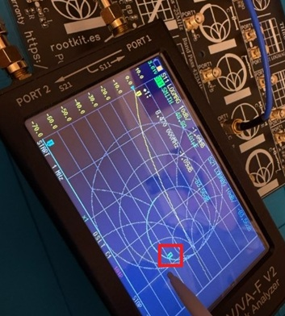

REMEMBER: Every time you change the frequency range, you must recalibrate your NanoVNA to obtain accurate results. Calibration compensates for losses and characteristics of your measurement system, ensuring that your results are as precise as possible within the limitations of the PCB design and components used.

# Your second demo: SWR S11 - 33 ohm

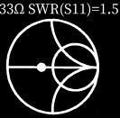

Recalibrate your NanoVNA for the new frequency range: 1 MHz - 100 MHz, and perform the same calibration steps as before: Reset CAL, (Open, Short, Load, Thru) to ensure accurate measurements for the 33 ohm demo.

Select DISPLAY from the main menu to enter the display settings.

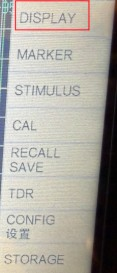

Connect PORT1 to the 33 ohm demo component on the umsakazo board, and you should see the S11 response on the screen.

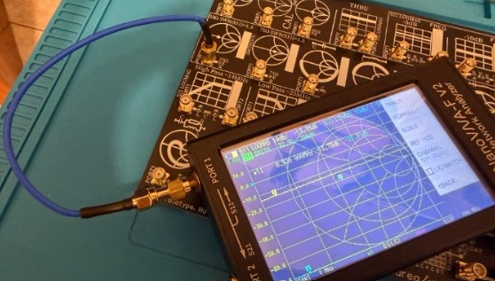

Select TRACE from the display menu to configure the trace settings.

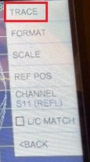

Select TRACE3 to configure the settings for the third trace.

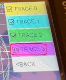

Select FORMAT to change the display format for the trace.

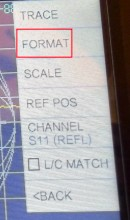

Select SWR to display the Standing Wave Ratio (SWR) for the S11 parameter.

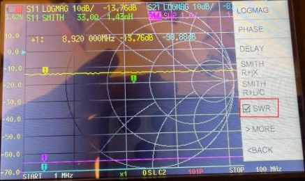

Select S11 (REFL) to display the S11 parameter for the SWR trace.

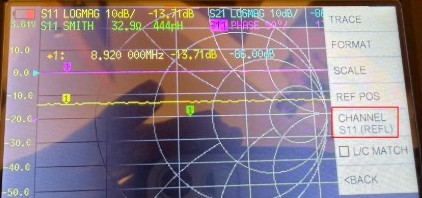

Now you should see the SWR response for the 33 ohm demo on the screen. The 1.5:1 SWR line indicates the point where the impedance is 33 ohms, which is a mismatch from the 50-ohm reference impedance. Is 1.5:1 because 33 ohms is 1.5 times less than 50 ohms (50/33 ≈ 1.5). The SWR will be higher at frequencies where the impedance mismatch is greater, and it will approach 1:1 at frequencies where the impedance is closer to 50 ohms.

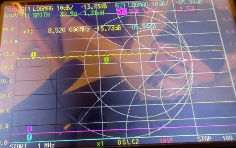

# Your third demo: S21 LOGMAG - Band Stop

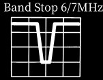

Recalibrate your NanoVNA for the new frequency range: 1 MHz - 9 MHz, and perform the same calibration steps as before: Reset CAL, (Open, Short, Load, Thru) to ensure accurate measurements for the Band Stop demo.

Connect PORT1 to the input (left) and PORT2 to the output (right) of the Band Stop demo component on the umsakazo board, and you should see the S21 response on the screen.

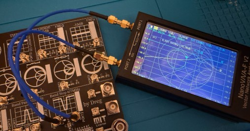

Now you can view the S21 LOGMAG response for the Band Stop demo. The S21 parameter represents the transmission coefficient, and in a band stop filter, you should see a drop in the S21 magnitude at the frequencies where the filter is designed to attenuate signals. The LOGMAG format displays the magnitude of S21 in decibels (dB), making it easier to visualize the attenuation effect of the band stop filter.

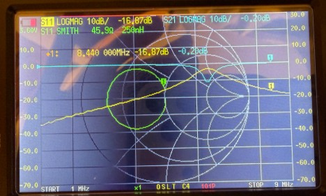

Select S21 LOGMAG UP RIGHT SCREEN RECTANGLE.

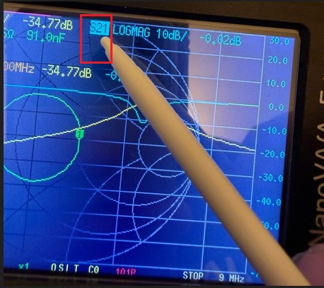

Move cursor 1 to analyze the S21 response. You should see the frequency and magnitude values for the point where the cursor is located, allowing you to identify the center frequency of the band stop filter and the amount of attenuation it provides at that frequency.

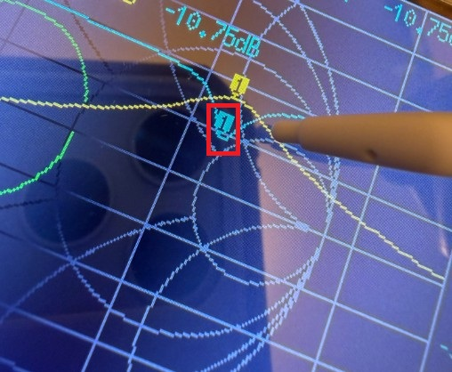

Select DISPLAY from the main menu to enter the display settings again.


Select SCALE to adjust the scale settings for the S21 LOGMAG trace.

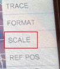

Select 2. 

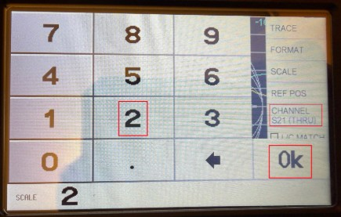

Now you should see the S21 LOGMAG response for the Band Stop demo with a scale of 2 dB per division, allowing you to better visualize the attenuation effect of the band stop filter across the frequency range.

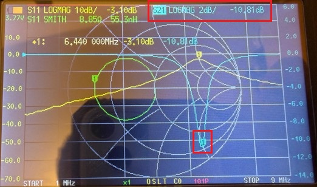

# Frequency Range and S-Parameters

The NanoVNA is a versatile vector network analyzer that can measure S-parameters (Scattering parameters) across a wide frequency range. S-parameters describe how RF signals behave in a network, such as reflection and transmission. The umsakazo board provides various components for testing, including resistors, capacitors, inductors, and attenuators.

# Measurement Frequency Ranges

| Demo | Frequency Range | Measurement Type |
|-----------|-----------------|------------------|
| 33 ohm | 1 MHz - 100 MHz | SWR S11 |
| 75 ohm | 1 MHz - 100 MHz | SWR S11 |
| -5 dB | 1 MHz - 9 MHz | S21 LOGMAG |
| -10 dB | 1 MHz - 9 MHz | S21 LOGMAG |
| C | 1 MHz - 250 MHz | SMITH S11 |
| L | 1 MHz - 100 MHz | SMITH S11 |
| RC Series | 1 MHz - 250 MHz | SMITH S11 |
| LC Series | 1 MHz - 30 MHz | SMITH S11 |
| RLC Series Parallel | 1 MHz - 800 MHz | SMITH S11 |
| RLC Parallel-Series | 1 MHz - 800 MHz | SMITH S11 |
| High Pass | 1 MHz - 40 MHz | S21 LOGMAG |
| Low Pass | 1 MHz - 80 MHz | S21 LOGMAG |
| SAW | 300 MHz - 460 MHz | S21 LOGMAG |
| Band Stop | 1 MHz - 9 MHz | S21 LOGMAG |

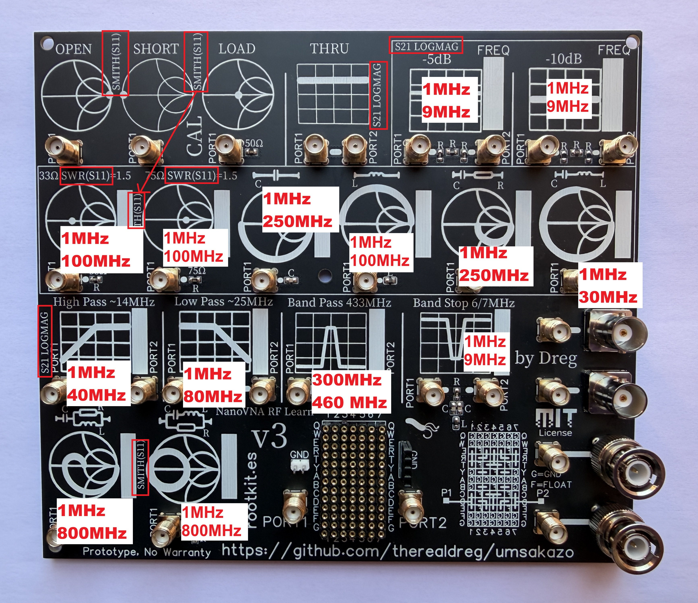

Note: you must calibrate your NanoVNA before performing measurements using the CAL zone.

Use outside of these ranges may not yield accurate results, just use it for fun and learning, not for precision measurements. 

Since each PCB and component set will be slightly different, I've left a white rectangle on each demo section where you can write or place a sticker with the exact frequency range that works best for your board. Variation between boards shouldn't be significant, but you may need to fine-tune the range slightly based on your specific components and PCB characteristics.

# S11 SMITH - CAPACITOR DEMO 


Just a capacitor connected to GND on one side and PORT1 on the other. You can use it to see how a capacitor behaves across different frequencies, and how it affects the S11 parameter on the Smith chart.

A capacitor to ground starts near the right side of the Smith chart because, at low frequency, its impedance is very high, so it behaves almost like an open circuit and reflects most of the signal. As the frequency increases, the capacitor impedance gets lower, so more signal is pulled to ground and the S11 trace moves clockwise along the lower outer edge, which is the capacitive region. The thick line ends closer to the left side because, in that part of the sweep, the capacitor is acting more and more like a short to ground. If the trace later bends or makes loops, that is usually caused by real-world parasitic inductance and resistance, not by an ideal capacitor.

# S11 SMITH - INDUCTOR DEMO


Just an inductor connected to GND on one side and PORT1 on the other. You can use it to see how an inductor behaves across different frequencies, and how it affects the S11 parameter on the Smith chart.

An inductor to ground starts near the left side of the Smith chart because, at low frequency, its impedance is very small, so it behaves almost like a short to ground. As the frequency increases, the inductor impedance becomes higher, so it pulls less signal to ground and the S11 trace moves through the upper part of the chart, which is the inductive region. The thick line ends closer to the right side because, at higher frequency, the inductor looks more and more like an open circuit. If the trace later bends or makes loops, that usually comes from real parasitic capacitance and resistance, not from an ideal inductor.

# S11 SMITH - RC SERIES DEMO


A resistor and capacitor in series between PORT1 and GND. You can use it to see how a simple RC series circuit behaves across different frequencies, and how it affects the S11 parameter on the Smith chart.

A capacitor in series with a 50 ohm resistor starts near the right side of the Smith chart because, at low frequency, the capacitor blocks the signal and the circuit looks almost like an open circuit. As the frequency increases, the capacitor reactance gets smaller, so the 50 ohm resistor becomes more visible to the source and the S11 trace moves through the lower part of the chart, which is the capacitive region. The thick line ends closer to the center because, in that part of the sweep, the capacitor is no longer blocking much and the circuit looks closer to a good 50 ohm match, so the reflection becomes smaller.

# S11 SMITH - LC SERIES DEMO


A capacitor and inductor in series between PORT1 and GND. You can use it to see how a simple LC series circuit behaves across different frequencies, and how it affects the S11 parameter on the Smith chart.

A series capacitor and inductor start near the right side of the Smith chart because, at low frequency, the capacitor dominates and the whole network looks almost like an open circuit. As frequency increases, the capacitive reactance gets smaller, so the trace moves along the lower outer edge until it reaches the left side, where the capacitor and inductor cancel each other and the circuit looks like a short circuit at resonance. Above that frequency, the inductor becomes dominant, so the trace continues through the upper outer edge and moves back toward the right side.

# S11 SMITH - RLC SERIES PARALLEL DEMO

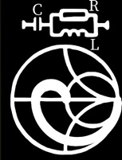

Just a capactor in series with a parallel combination of a resistor and inductor, between PORT1 and GND. You can use it to see how a more complex RLC circuit behaves across different frequencies, and how it affects the S11 parameter on the Smith chart.

This network starts near the right side of the Smith chart because, at low frequency, the series capacitor blocks the signal and the input looks almost like an open circuit. As frequency increases, the capacitor reactance gets smaller, so the shunt branch becomes visible, and since the inductor to ground looks very low impedance at first, it pulls the trace toward the left side like a near short. Then the curve bends inward and makes a loop because the 50 ohm resistor in parallel is always there, preventing a perfect short and damping the movement. At higher frequency, the inductor looks less like a short and more like an open circuit, while the capacitor looks more like a wire, so the circuit moves closer to the behavior of a simple 50 ohm load and the trace comes back toward the center.

# S11 SMITH - RLC PARALLEL-SERIES DEMO


Just a parallel combination of resistor and a capacitor in series with an inductor, between PORT1 and GND. You can use it to see how a more complex RLC circuit behaves across different frequencies, and how it affects the S11 parameter on the Smith chart.

This network starts near the center of the Smith chart because, at low frequency, the series capacitor blocks the LC branch, so the input mainly sees the 50 ohm resistor to ground, which is a good match. As the frequency increases, the LC branch starts to conduct and pulls the trace away from the center; below resonance it behaves like a capacitive shunt, so the curve moves through the lower half. At resonance, the series capacitor and inductor cancel each other, so that branch becomes almost a short to ground and the trace reaches the left side. Above resonance, the branch becomes inductive and its impedance rises again, so its effect becomes weaker and the trace comes back toward the center.

# S11 SWR - 33 OHM & 75 OHM DEMO

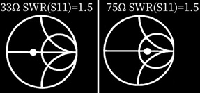

Just a 33 ohm and 75 ohm resistor connected between PORT1 and GND. You can use them to see how different resistive loads affect the S11 parameter and the SWR (Standing Wave Ratio) on the NanoVNA.

A 75 ohm resistor and a 33 ohm resistor can both give about the same SWR in a 50 ohm system because SWR depends on how much the load differs from 50 ohms, not on whether the resistance is higher or lower. A 75 ohm load is above 50 ohms, so its point appears to the right of center, while a 33 ohm load is below 50 ohms, so its point appears to the left, but both are nearly the same distance from the center of the Smith chart. That means they produce nearly the same reflection magnitude, so the SWR is about 1.5 in both cases. Strictly speaking, the exact value symmetric to 75 ohms is 33.3 ohms, so 33 ohms is just a rounded practical example.

The SWR value of 1.5 comes from the reflection coefficient in a 50 ohm system. For a purely resistive load, the reflection coefficient is ((Z_L - 50)/(Z_L + 50)). With 75 ohms, this gives (25/125 = 0.2), and the SWR becomes ((1 + 0.2)/(1 - 0.2) = 1.5). A resistor below 50 ohms gives the same SWR if it creates the same reflection magnitude in the opposite direction. That is why 75 ohms and about 33.3 ohms are symmetric cases on the Smith chart: one is to the right of center, the other is to the left, but both are the same distance from the center, so both give the same SWR.

# S21 LOGMAG - HIGH PASS DEMO

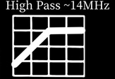

Just connect PORT1 (left) to the input and PORT2 (right) to the output of the high pass filter demo on the umsakazo board. You can use it to see how a simple high pass filter behaves across different frequencies, and how it affects the S21 parameter in LOGMAG format on the NanoVNA.

This circuit is a high-pass filter built as a pi network, with one capacitor in series and one inductor to ground on each side, and that is why the S21 log magnitude curve starts low, rises through the transition region, and then becomes nearly flat. The series capacitor is the main part that blocks low-frequency signals and lets higher-frequency signals pass, while the two shunt inductors help remove unwanted low-frequency energy by giving it a path to ground from both sides of the network. Using two inductors instead of just one makes the filtering stronger and cleaner, improves the shape of the response, and helps the filter behave better between the input and output ports. At low frequency, the capacitor is hard to pass through and the inductors load the signal, so very little reaches the output. As frequency increases, the capacitor becomes easier to pass through and the inductors stop pulling the signal down as much, so transmission increases. Once the signal is in the passband, the network no longer blocks it much, so S21 stays high and the trace looks almost flat.

# S21 LOGMAG - LOW PASS DEMO

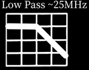

Just connect PORT1 (left) to the input and PORT2 (right) to the output of the low pass filter demo on the umsakazo board. You can use it to see how a simple low pass filter behaves across different frequencies, and how it affects the S21 parameter in LOGMAG format on the NanoVNA.

This circuit is a low-pass filter built as a pi network, with one inductor in series and one capacitor to ground on each side, and that is why the S21 log magnitude trace starts high, then rolls off, and finally becomes very low at higher frequency. The series inductor lets low-frequency signals pass more easily, but as frequency increases it starts to oppose the signal more and more, reducing transmission. At the same time, the two shunt capacitors give high-frequency energy a path to ground from both sides of the network, so less of that signal reaches the output. Using two capacitors instead of just one makes the filtering stronger, improves the shape of the response, and helps the filter behave better between the input and output ports. That is why low frequencies pass with little loss, while higher frequencies are increasingly attenuated.

# Band Stop Filter DEMO

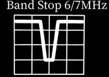

Just connect PORT1 (left) to the input and PORT2 (right) to the output of the band stop filter demo on the umsakazo board. You can use it to see how a simple band stop filter behaves across different frequencies, and how it affects the S21 parameter in LOGMAG format on the NanoVNA.

This circuit is a band-stop, or notch, filter, so the S21 log magnitude trace starts high, drops sharply in the reject band, and then rises again after that frequency range. The two capacitors form the main signal path between the input and output, and they also work together with the inductor to create the notch. The inductor to ground is the part that removes energy at the stop frequency, because at that point the LC network resonates and the signal is strongly diverted away from the output. Away from resonance, that shunt path is much less effective, so the signal can pass again and S21 goes back up. The resistor across the network helps control the shape and depth of the notch, makes the response smoother, and helps the filter behave more predictably between the two ports.

# S21 LOGMAG - Band Pass 433MHz SAW DEMO 

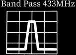

Just connect PORT1 (left) to the input and PORT2 (right) to the output of the SAW filter demo on the umsakazo board. You can use it to see how a simple band pass filter behaves across different frequencies, and how it affects the S21 parameter in LOGMAG format on the NanoVNA.

This band-pass filter uses a SAW device, which means Surface Acoustic Wave. Inside it, the electrical signal is converted into a very small mechanical wave that travels across a piezoelectric material, and then it is converted back into an electrical signal at the output. It works because the internal metal patterns are designed so that only a narrow range of frequencies creates the right acoustic wave and passes through efficiently, while frequencies above and below that range are strongly attenuated. That is why the S21 trace is low outside the passband, rises sharply in the wanted band, and then falls again. The main advantage of a SAW filter is that it gives very selective filtering in a very small part, so it is excellent for separating one RF band from nearby unwanted signals. It is widely used because it is compact, stable, and gives much better selectivity than a simple LC network of similar size.

# Attenuator DEMO

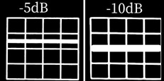

Just connect PORT1 (left) to the input and PORT2 (right) to the output of the attenuator demo on the umsakazo board. You can use it to see how a simple attenuator behaves across different frequencies, and how it affects the S21 parameter in LOGMAG format on the NanoVNA.

These two circuits are resistive attenuators, so their S21 trace is almost a flat horizontal line because resistors do not filter one frequency more than another in the ideal case. The resistor in series reduces the signal that can go straight from input to output, and the two resistors to ground remove part of the signal energy while also helping the circuit stay close to the system impedance, so the source and load still see a good match. In the -5dB version, the resistor values are chosen so only part of the signal is lost, which is why the line stays a little below the top. In the -10dB version, the values make the attenuation stronger by reducing the direct path more and sending more energy to ground, so the line appears lower. In simple terms, both circuits do the same job, but the second one throws away more signal than the first one.

# PCB Design Limitations

The umsakazo board is designed with simplicity and affordability as key priorities. The design philosophy focuses on:

- **Simple Bill of Materials (BOM)** - Common, readily available components that are easy to source
- **Cost-effective PCB** - Optimized for educational use without unnecessary complexity
- **Easy component replacement** - 0805 SMD components can be quickly swapped to experiment with different values and behavior
- **Accessible learning tool** - Designed for students and hobbyists to learn RF fundamentals without expensive equipment

This approach prioritizes hands-on learning and experimentation over precision, making the board an excellent platform for understanding RF concepts and component behavior.

The board uses 0805 SMD components, which are not ideal for high-frequency due to their parasitic effects.

The PCB design is not optimized for high-frequency measurements. As a standard FR4 board without strict impedance control, several factors affect measurement accuracy:

- **Parasitic effects** from the 0805 SMD components introduce unwanted inductance and capacitance
- **Board material** and trace routing introduce loss and phase shift
- **Lack of impedance matching** between components and traces
- **Component placement** affects signal integrity at higher frequencies

These limitations are inherent to the learning board design and should be considered when interpreting results, especially above the recommended frequency ranges. This is ideal for educational purposes and experimentation, not for precision RF measurements.

The coplanar waveguide design is used for the RF traces, which provides a simple and cost-effective way to route high-frequency signals on a PCB. However, it is not optimized for high-frequency performance, and the lack of proper impedance control can lead to signal degradation and inaccurate measurements at higher frequencies.

# Design Files and Documentation

This PCB is released under the MIT License. All design files will be made available in the repository by the end of 2027. The repository will include:

- **Gerber files** - For PCB manufacturing
- **PCB layout files** - Complete board design
- **Pick & Place files** - Component placement coordinates for assembly
- **Bill of Materials (BOM)** - Complete list of components with part numbers
- **Schematic files** - Detailed electrical schematics

You are welcome to use these files to manufacture your own board, modify the design to suit your specific requirements, or adapt the project for educational and commercial purposes, as permitted by the MIT License.

# Future Improvements and Community Release

During 2026 and 2027, I will continuously optimize the Bill of Materials (BOM) to reduce costs while maintaining quality. **The final production release will be published once we achieve optimized component sourcing and cost-effective pricing.** Currently, material costs are higher than target, and we are working with suppliers to bring these down before the community release.

We welcome feedback from early adopters and users to enhance both the design and documentation. If you have suggestions, please open an issue. The final version will reflect community input and market-driven improvements to deliver maximum value.

If you would like to explore different design directions, feel free to fork the project and create your own version.

# Greetings

Gonzalo Carracedo @BatchDrake & Carlos Cabezas @EB4FBZ, who are true RF experts, and from whom I always learn so much through their critiques, comments, and conversations in the HardwareHackingES Telegram channel.

# Learn More

## Video 

- Resonance in AC Circuits Visualised | Series RLC Circuit, Resonant Frequency & Q Factor by Decipher Physics: https://www.youtube.com/watch?v=og6KsSDd644
- Impedance & Reactance (Full Visual Explanation) by Decipher Physics: https://www.youtube.com/watch?v=akVP_TF7jDI
- How to properly use a NanoVNA V2 Vector Network Analyzer & Smith Chart (Tutorial) by  Andreas Spiess: https://www.youtube.com/watch?v=_pjcEKQY_Tk
- Inverted-F PCB Antenna: How to tune PCB circuits using a NanoVNA by HB9BLA Wireless: https://www.youtube.com/watch?v=rbXq0ZwjETo
- NanoVNA Port Extension using the Electrical Delay setting by w2aew: https://www.youtube.com/watch?v=bEPUePy_buM
- NANOVNA Made Simple by IMSAI Guy: https://www.youtube.com/watch?v=QJYeFpiqY8c
- NANOVNA making BNC VNA calibration set by  IMSAI Guy: https://www.youtube.com/watch?v=I0kIH492DcY
- Transmission Line Terminations for Digital and RF signals - Intro/Tutorial by w2aew: https://www.youtube.com/watch?v=g_jxh0Qe_FY
- Smith Chart: Z, VSWR, Reflection Coef and Transmission Line Effects by w2aew: https://www.youtube.com/watch?v=ImNRca5ecF0
- Basics of the Smith Chart - Intro, impedance, VSWR, transmission lines, matching by w2aew: https://www.youtube.com/watch?v=TsXd6GktlYQ
- Why a VNA needs to be calibrated | how to calibrate a nanoVNA by w2aew: https://www.youtube.com/watch?v=x-tbvAbh9jk
- Use NanoVNA to measure coax length - BONUS Transmission Lines and Smith Charts, SWR and more by w2aew: https://www.youtube.com/watch?v=9thbTC8-JtA
- Debunking SWR Myths Once and For All! by TheSmokinApe Ham Radio: https://www.youtube.com/watch?v=5z6VnWC6V2g
- Understanding VNAs - Antenna Measurements by Rohde & Schwarz: https://www.youtube.com/watch?v=15-hd_JjmYY
- Understanding VSWR and Return Loss by Rohde & Schwarz: https://www.youtube.com/watch?v=BijMGKbT0Wk
- Understanding the Smith Chart by Rohde & Schwarz: https://www.youtube.com/watch?v=rUDMo7hwihs
- Understanding S Parameters by Rohde & Schwarz: https://www.youtube.com/watch?v=-Pi0UbErHTY 
- Understanding VNA Calibration Basics by Rohde & Schwarz: https://www.youtube.com/watch?v=bLfbg2p7PaE
- Understanding VNAs - Segmented Sweeps by Rohde & Schwarz: https://www.youtube.com/watch?v=XP4QBpu9MO0 
- Understanding VNAs - Cable Loss Measurements by Rohde & Schwarz: https://www.youtube.com/watch?v=xqLQH0eWs3E  
- Understanding VNAs - Cable Impedance Measurements by Rohde & Schwarz: https://www.youtube.com/watch?v=SaCH3Z7veNc


## Doc

- Measurement and Application of Scattering Parameters in RF-Design by PROF. DR. THOMAS BAIER: [stuff/doc/HamRadio DG8SAQ 2013 English](stuff/doc/HamRadio_DG8SAQ_2013_English.pdf)
- RF engineering basic concepts: the Smith chart by F. Caspers - CERN, Geneva, Switzerland: [stuff/doc/p95.pdf](stuff/doc/p95.pdf)

# People to follow 

- Gonzalo Carracedo @BatchDrake https://x.com/BatchDrake
- Carlos Cabezas @EB4FBZ https://x.com/eb4fbz
- Mehdi @MehdiHacks https://x.com/MehdiHacks
- https://www.youtube.com/@DecipherPhysics
- https://www.youtube.com/@AndreasSpiess
- https://www.youtube.com/@HB9BLA
- https://www.youtube.com/@w2aew
- https://www.youtube.com/@IMSAIGuy
- https://www.youtube.com/@TheSmokinApe


